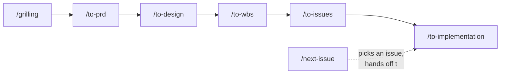

# Feature Development Workflow

How work moves from an idea to a merged, deployed change in this repo (and, once ported, in
`event-creator`). See [CLAUDE.md](../CLAUDE.md#feature-workflow) for the short version; this doc
is the full walkthrough, stage by stage, with the agents each stage uses.

## When to use the full pipeline

- **Minor changes** (docs, small fixes, one obvious change): skip straight to a GitHub issue, or
  straight to a branch. No feature directory, no pipeline.
- **Major changes** (spans more than one deployable slice, or needs a real design/architecture
  decision — new schema, new external integration, a new seam): work through the pipeline below
  before any code gets written.

This is the same minor/major distinction CLAUDE.md's Git Workflow section already uses for
branching — the pipeline is just what "major" means for *planning*, not a separate rule.

## The pipeline



Each arrow is a real file handoff — every skill reads exactly what the previous one wrote, at a
fixed path, so nothing downstream has to re-derive context:

| Stage | Skill | Reads | Writes | Agents used |
|---|---|---|---|---|
| 1. Interview | `/grilling` | the conversation | nothing — clarity, not artifacts | none |
| 2. Requirements | `/to-prd` | conversation context | `docs/features/<feature-slug>/PRD.md` | none |
| 3. Design | `/to-design` | `PRD.md` | `docs/features/<feature-slug>/TDD.md` + any `docs/adr/<feature-slug>-<decision-slug>.md` | `fastapi-expert`, `clean-architecture-expert`, `microservices-architect` (parallel) |
| 4. Slicing | `/to-wbs` | `PRD.md` + `TDD.md` | `docs/features/<feature-slug>/WBS/slice-<n>-<name>.md` (one per slice) | none (interactive quiz with the user) |
| 5. Issue filing | `/to-issues` | one WBS slice file | a GitHub issue, labeled `<feature-slug>` + `<slice-id>` + `enhancement` | none (interactive quiz with the user) |
| 6. Build | `/to-implementation` | the issue + its WBS slice | code, PR, a `## Delivered` section appended to the WBS slice, one `changelog.md` line | `code-review-master`, `code-quality-guardian` (review pass) |
| — | `/next-issue` | the GitHub project board | picks the next issue, hands off to `/to-implementation` | none |

## Stage detail

### 1. `/grilling` — the only interview

Relentlessly interviews you about the feature until requirements are actually settled. Every
skill downstream of this one is deliberately interview-free — they assume `/grilling` (or an
equivalent conversation) already happened. If you jump straight to `/to-prd` with a thin
conversation, it will tell you to come back here first rather than start quizzing you itself.

### 2. `/to-prd` — write the PRD

Pure synthesis: turns the conversation into `docs/features/<feature-slug>/PRD.md` (problem
statement, solution, user stories, implementation/testing decisions, out of scope). Doesn't touch
GitHub — no tracking issue gets created for the feature as a whole. Determines the `<feature-slug>`
and which repo the feature directory belongs in (see [Where a feature lives](#where-a-feature-lives)
below).

### 3. `/to-design` — resolve the engineering decisions

Reads the PRD and spawns three sub-agents **in parallel**, each reviewing it from a different
angle:

- **`fastapi-expert`** — stack-specific concerns: endpoints, schemas, migrations, background
  work, testing seams (the stack is Python 3.12 + FastAPI in both `organize-me` and
  `event-creator`).
- **`clean-architecture-expert`** — layering and boundaries: where the new logic should live
  relative to existing modules, what stays decoupled from what.
- **`microservices-architect`** — service/deployment topology: does this stay within one app,
  does it cross the Host/hosted-app boundary, any infra implications.

Claude synthesizes their input (plus its own judgment where they disagree) into `TDD.md`, and
writes a dedicated ADR — `docs/adr/<feature-slug>-<decision-slug>.md` — for every decision that
has a genuine trade-off, linked back from `TDD.md`.

### 4. `/to-wbs` — cut it into vertical slices

Reads `PRD.md` + `TDD.md` and drafts **tracer-bullet** slices — each one a thin but complete path
through every layer (schema, API, UI, tests), independently demoable. Quizzes you on granularity
and dependencies before writing anything. On approval, writes one
`docs/features/<feature-slug>/WBS/slice-<n>-<name>.md` per slice, each with What to build / Design
notes / Blocked by / Acceptance criteria / Testing — and room for a Delivered section to be
appended later.

### 5. `/to-issues` — publish one slice as an issue

Takes one already-approved WBS slice (not the whole feature) and quizzes specifically on whether
its acceptance criteria are concrete enough for `/to-implementation` to start without asking
follow-up questions. Publishes the GitHub issue with three labels: `<feature-slug>`, `<slice-id>`
(e.g. `slice-2`), and `enhancement`.

### 6. `/to-implementation` — build it

Locates the WBS slice from the issue's labels, implements it (using `/tdd` at agreed seams,
sub-agents/worktrees as needed), then runs a review pass with **`code-review-master`** and
**`code-quality-guardian`**. Anything worth fixing gets fixed now; anything else becomes a new
Intake issue carrying the same feature/slice labels plus `modelsuggested`. Once merged and
deployed: appends a `## Delivered` section to the WBS slice (issue #, branch, date, outcome) and
adds one line to `docs/changelog.md`.

### `/next-issue` — pick what's next

Not part of the linear pipeline — this is the entry point when you just want to know what to work
on. Reads the GitHub project board, groups ready (`Todo`) work by track (a feature-slug, or the
legacy `restructure` track) and slice, and picks one deliberately (earliest slice first, then
bug > enhancement > future-enhancement > other, then judgment within a tier). If more than one
track has ready work, it asks you which to prioritize rather than guessing. Hands off to
`/to-implementation`.

## Where a feature lives

A feature's directory goes in whichever repo it actually concerns:

- **Single-app feature** → that app's own repo (e.g. an event-creator-only feature gets
  `event-creator/docs/features/<feature-slug>/`).
- **Cross-app / platform feature** → `organize-me`, since it's the Host.

```
docs/features/<feature-slug>/
  PRD.md
  TDD.md
  WBS/
    slice-1-<name>.md
    slice-2-<name>.md
```

`docs/features/platform-restructure/` and `docs/features/original-organize-me/` are the two
pre-existing bodies of work this convention formalizes — moved under `docs/features/` to match,
but kept in their original shape (their own filenames, not renamed to `PRD.md`/`TDD.md`/
`WBS/slice-<n>-<name>.md`) rather than rewritten.

## ADRs

Architecture decisions live centrally per-repo at `docs/adr/<feature-slug>-<decision-slug>.md` — a
sibling of `docs/features/`, not nested inside a feature directory.

## Delivery history

`docs/changelog.md` is the single source of "what shipped": one line per merged issue, linking to
the relevant WBS slice's `## Delivered` section (or the issue/PR itself for a small change with no
WBS slice). `docs/project-status.md` no longer exists — the changelog index plus each WBS slice's
own status is that view now.
