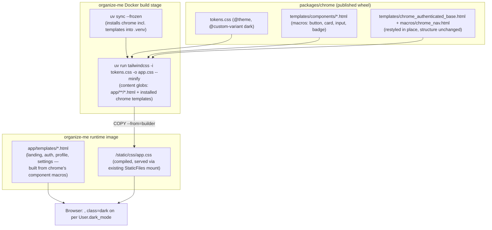

# Design Refresh — Technical Design

**Feature:** [`PRD.md`](PRD.md)
**Date:** 2026-07-18
**Status:** Draft

## Architecture at a Glance

- Drop DaisyUI and the Tailwind CDN "Play" script entirely. `packages/chrome` ships a Tailwind v4
  `@theme` token CSS file (no `tailwind.config.js` — v4's CSS-native config needs none) plus a small
  set of shared Jinja component macros (button, card, input, badge) as chrome package data.
- **Each consuming service compiles its own CSS**, at its own Docker build time, via `pytailwindcss`
  (no Node/npm) scanning its own templates + the installed `organizeme_chrome` package's templates.
  `packages/chrome` never runs a build itself and ships no precompiled CSS — see
  [ADR: per-service Tailwind build](../../adr/design-refresh-per-service-tailwind-build.md).
- Dark mode stays DB-driven (`User.dark_mode`) via an explicit `.dark` class on `<html>` and a
  Tailwind v4 `@custom-variant`, not the framework's OS-preference-driven default — see
  [ADR: dark-mode CSS strategy](../../adr/design-refresh-dark-mode-css-strategy.md).
- Shared component **primitives** (not just tokens) live centrally in `packages/chrome`; app-specific
  page **compositions** (organize-me's login/register/profile layouts, the landing hero) stay local
  to `organize-me`, built from chrome's primitives — see
  [ADR: shared component library](../../adr/design-refresh-shared-component-library.md).
- One token system, one component set, with a density/decoration variant (not two divergent
  component sets) implementing the PRD's marketing-vs-product page-type split.
- The sidebar (recently extended by the in-flight `sidebar-nav-groups` feature) is restyled in place
  — class substitution only, no DOM/structural changes — see
  [ADR: sidebar restyle in place](../../adr/design-refresh-sidebar-restyle-in-place.md).

## Design Decisions

### 1. Build pipeline & CSS distribution

`organize-me`'s `pyproject.toml` gains a dedicated build-only dependency group (`pytailwindcss`),
mirroring the existing `[dependency-groups] dev` pattern. The `Dockerfile` becomes multi-stage:

- **Build stage**: `uv sync --frozen` (full sync, including the `pytailwindcss` group and the
  chrome dependency — the Tailwind content-scan needs chrome's templates physically present on
  disk), then `uv run tailwindcss -i <tokens entry css> -o app/static/css/app.css --minify`.
- **Runtime stage**: `uv sync --frozen --no-dev` (excludes the build-only group entirely), copies
  `app/`, and `COPY --from=builder` only the compiled `app.css` artifact.

This keeps the ~35-40MB Tailwind CLI binary and build-only Python packages out of the deployed
image. The compile step must run in the same layer/step as (immediately after) the dependency
install — never cached independently of it — so a Docker layer-caching bug can't serve CSS compiled
against a stale template set (see ADR's Consequences for the failure mode this avoids).

`packages/chrome` exposes a small helper function returning its own installed template directory
path, so `organize-me`'s Tailwind content-glob config doesn't hardcode a guessed `site-packages`
path.

Local dev: `pytailwindcss` isn't wired into `uvicorn --reload`. Document running
`uv run tailwindcss -i ... -o ... --watch` in a second terminal alongside the app — an explicit,
separate dev command, not an automatic hook.

Full decision + rejected alternatives (precompiled-in-chrome, hybrid, premature shared-pipeline
abstraction):
[ADR: per-service Tailwind build](../../adr/design-refresh-per-service-tailwind-build.md).

### 2. Tailwind version & token ownership

Target Tailwind v4, using its CSS-native `@theme` block — eliminates any JS config file, keeping the
stack genuinely Node-free. Pin the Tailwind CLI version explicitly via `pytailwindcss`'s version
config so dev/CI/Docker can't silently drift onto different CLI releases with different output.

Tokens move out of `theme.py` (currently literal CDN URLs + DaisyUI theme-name strings) into a CSS
file — `packages/chrome/src/organizeme_chrome/static/css/tokens.css` — shipped as chrome package
data, using the "Signal" palette/type system from the PRD:

```css
@theme {
  --color-ink: #14161c;
  --color-paper: #f6f4ef;
  --color-paper-2: #eeece4;
  --color-flame: #ff4b33;
  --color-cobalt: #2f4b7c;
  --color-cobalt-tint: #e3e9f3;
  --color-mist: #eef1f5;
  --color-mist-2: #e2e7ee;
  --color-sage: #2f7d5c;
  --color-sage-tint: #e1f0e8;
  --font-display: "Bricolage Grotesque", ui-sans-serif, system-ui, sans-serif;
  --font-body: "IBM Plex Sans", ui-sans-serif, system-ui, sans-serif;
  --font-mono: "JetBrains Mono", ui-monospace, monospace;
}
@custom-variant dark (&:where(.dark, .dark *));
```

(Exact token names/values above are illustrative of the shape — `/to-wbs`/`/to-implementation`
finalize precise scales.) `theme.py` shrinks to:

```python
def theme_attr(dark_mode: bool) -> Literal["dark", ""]:
    return "dark" if dark_mode else ""
```

Python stays the source of truth for *which* mode is active (unchanged from today); CSS is the
source of truth for *what each mode looks like*. No token-value duplication into Python — nothing
in this codebase needs a color value outside CSS today (no email templates in scope); revisit with a
codegen step only if a real second consumer appears later.

Self-hosted webfonts (Bricolage Grotesque, IBM Plex Sans, JetBrains Mono) ship as static font files
served from `organize-me`'s existing `/static` mount, referenced via `@font-face` in the tokens CSS
— no external font CDN.

### 3. Shared component boundary

New `packages/chrome/src/organizeme_chrome/design/` subpackage (sibling to the existing flat
modules) plus a matching `templates/components/` directory (sibling to the existing
`templates/macros/`). Primitives shipped here: button, input, badge, card shell, status-dot — each
a Jinja macro over the new Tailwind classes, following the existing `nav_link`-macro precedent for
preventing markup drift between call sites.

The marketing-vs-product page-type split (PRD decision) is implemented as **one** component set
with a density/decoration variant, not two component sets — e.g. a `variant` macro parameter or a
`data-density="marketing"|"product"` wrapping scope that Tailwind variants key off, both drawing
from the same token base (`Paper` vs `Mist` background tokens, spacing scale). The landing hero's
chat-bubble-to-calendar-chip signature illustration is the one genuinely bespoke piece — it's
organize-me-page-level composition, not a chrome primitive, and doesn't need to generalize.

`app/templates/macros/ui.html`'s `card_page()` is retired, replaced by the new chrome-provided card
primitive, closing the "component built locally instead of centrally" gap this pattern represented.

Full decision + rejected alternative (tokens-only in chrome):
[ADR: shared component library](../../adr/design-refresh-shared-component-library.md).

### 4. Sidebar & chrome restyling

`chrome_authenticated_base.html` / `macros/chrome_nav.html` get a class-substitution pass only — the
DOM structure, element IDs, and Alpine.js wiring `sidebar-nav-groups` already built and tested stay
exactly as they are. Before merging, verify via rebase/diff that `registry-decoupling` hasn't landed
conflicting markup changes to the same files in parallel (its own scope is registry data, not
markup, so this is a sequencing check, not an expected conflict).

Full decision + rejected alternative (structural rewrite):
[ADR: sidebar restyle in place](../../adr/design-refresh-sidebar-restyle-in-place.md).

### 5. Scope boundary: organize-me pages

`app/templates/landing.html` is restyled (hero/features/CTA structure kept, per the PRD — it's
sound, just needs the new visual system) and gains the chat-bubble-to-calendar-chip signature
moment. Auth pages (login/register/forgot-password/reset-password), profile, and the settings shell
are rebuilt on the new card/input/button primitives, replacing `card_page()` call sites.

## Component/Data Flow



## Testing Approach

- **New CI seam — build correctness.** A step runs the Tailwind compile, then asserts (a) the output
  file is non-empty above a size threshold, and (b) a "canary class" — a utility class known to be
  used by chrome's current templates — actually appears in the compiled output. This catches both
  "content globs broke, near-empty CSS produced" and "stale build served against old templates" as
  hard CI failures rather than silent visual breakage. Complements (doesn't replace) the PRD's
  planned Playwright smoke check that the compiled stylesheet is served with a 200.
- **`tests/test_card_macro.py` rewrite.** Replace the DaisyUI-class-string pins (`"card-body"`,
  `"card-title"`, `"max-w-lg"`, `"max-w-sm"`) with the new component classes/macro output. Keep the
  *structural* assertions this test's value actually comes from (the title renders as an `<h1>`, the
  right width variant applies to the right page) — those regression checks matter regardless of
  which class names back them.
- **Dark-mode test.** A new test asserting `class="dark"` appears on `<html>` when `User.dark_mode`
  is true and is absent otherwise — verifies the class-based (not OS-preference) mechanism from
  [ADR: dark-mode CSS strategy](../../adr/design-refresh-dark-mode-css-strategy.md) is actually
  wired up, not just present in config.
- **Existing E2E suite (`e2e/tests/`) stays the regression backstop.** Functional assertions (login
  works, forms submit, password reset completes) are expected to keep passing unmodified throughout
  — behavior isn't changing, only markup/styling. Per the PRD: extended with a smoke check that the
  DaisyUI stylesheet/Tailwind CDN script are no longer referenced.
- **Out of scope** (per PRD): visual regression/screenshot-diff tooling.

## Open Questions

- Exact final component class-naming convention (e.g. BEM-style `card__title` vs. plain utility
  composition) isn't pinned here — left for `/to-wbs`/`/to-implementation` to settle concretely
  during the first component-building slice.
- Precise token scale (full color-shade ramps if needed beyond the six named PRD colors, spacing
  scale, type scale steps) needs finalizing during implementation — the `@theme` block above is
  illustrative of shape, not final values.
- Self-hosted webfont sourcing specifics (exact font files/weights needed, subsetting) — flagged for
  the implementation slice that builds the tokens CSS, not blocking design-level decisions here.
- ~~Confirm at implementation time whether `registry-decoupling` has landed any markup changes to
  `chrome_authenticated_base.html`/`chrome_nav.html`~~ — **resolved by cross-reference (2026-07-18):**
  read against `registry-decoupling`'s full PRD/TDD/ADRs (the user plans to implement it first).
  Its scope is entirely the data/API layer — a new `RegistrySource` protocol, a leaf
  `registry_client.py` module, and a new Host-side internal endpoint — and its own
  `registry-decoupling-client-boundary` ADR explicitly commits to keeping `templating.py`,
  `nav_groups.py`, `jwt_verify.py`, and every chrome template untouched. No file-level or
  design-level conflict with this feature. Two low-risk mechanical notes for whoever implements
  this feature after registry-decoupling lands: (1) `packages/chrome/pyproject.toml` will already
  carry registry-decoupling's new runtime deps (`httpx`, `google-auth`) — this feature's own edits
  to that file (wheel package-data config for CSS/fonts/components) land in unrelated sections, low
  merge risk but don't assume today's exact file content; (2) the `organizeme-chrome` package tag
  will have bumped 2-3 times during registry-decoupling's own multi-slice rollout before this
  feature starts — treat `chrome-v0.5.5` (this TDD's exploration baseline) as illustrative, not the
  actual starting pin.
