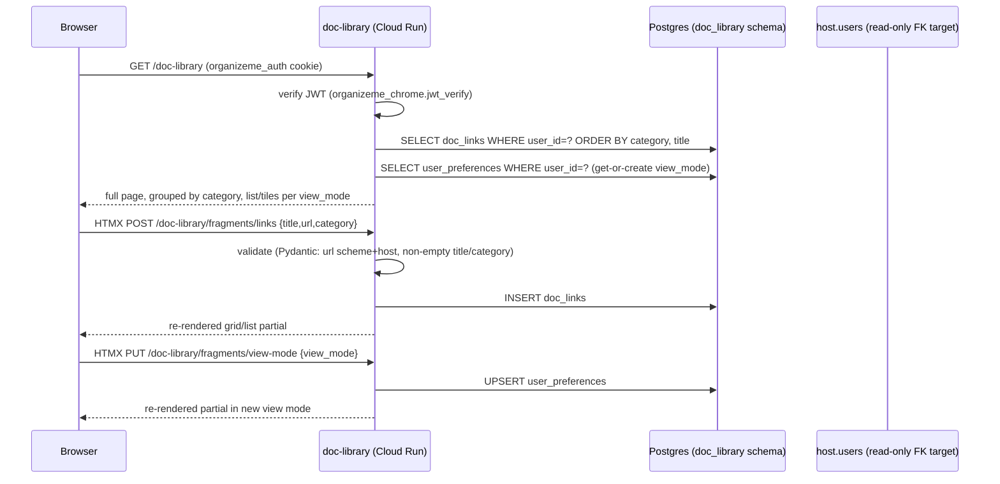

# Doc Library — Technical Design

**Feature:** [`PRD.md`](PRD.md)
**Date:** 2026-07-17
**Status:** Draft

## Architecture at a Glance

- New standalone repo `doc-library`, FastAPI + async SQLAlchemy + Alembic, structured as a
  trimmed-down copy of `event-creator`'s layout (`app/pages`, `app/api/v1`, `app/models`,
  `app/schemas`, `app/core`, `app/db`) — with the `app/services/` layer deliberately **not**
  copied; this app has no cross-cutting business logic to justify it (see
  [ADR: no dedicated service layer](../../adr/doc-library-service-layer.md)).
- Two tables in a new `doc_library` Postgres schema: `doc_links` (the CRUD entity) and
  `user_preferences` (a lazily-created singleton-per-user row holding `view_mode`) — two
  independent Alembic migrations, since they have no FK relationship or shared lifecycle.
- No login/session code of its own. Identity comes entirely from verifying the Host's JWT cookie
  via the shared `organizeme_chrome.jwt_verify` helper, copied verbatim from `event-creator`'s
  `app/core/auth.py` pattern.
- The page (`GET /doc-library`) renders full-page server-side; add/edit/delete/view-toggle
  interactions are HTMX partial swaps against dedicated fragment routes, matching
  `event-creator`'s Settings-fragment precedent rather than introducing hand-written client JS or
  a SPA-style JSON-driven frontend (see
  [ADR: HTMX fragments over a JSON-driven frontend](../../adr/doc-library-htmx-rendering.md)).
- A separate, pure-JSON `/api/v1/doc-links` surface exists alongside the HTML fragment routes —
  same underlying query functions, two thin presentation layers — for test/API consumers and to
  keep the JSON contract uncluttered by content negotiation.
- Manual setup (new repo, secrets, LB routing) follows the existing `how-to-add-a-hosted-app.md`
  playbook almost exactly, with two confirmed simplifications specific to this app (no
  `ENCRYPTION_KEY`, no new GCP service account) — see the dedicated section below.

## Design Decisions

### Schema

`doc_library.doc_links`:

| column       | type                          | notes                                              |
|--------------|-------------------------------|-----------------------------------------------------|
| `id`         | UUID PK                       | `default=uuid.uuid4`                                |
| `user_id`    | UUID, `FK host.users.id`      | `ON DELETE CASCADE`, `REFERENCES`-only grant per R1  |
| `title`      | text, not null                | trimmed, non-empty (validated at the schema layer)   |
| `url`        | text, not null                | `http`/`https` + non-empty host, validated at the schema layer |
| `category`   | text, not null                | freeform; grouping is `GROUP BY` the raw string, no normalization beyond `.strip()` |
| `created_at` | timestamptz, `server_default=func.now()` | |

`doc_library.user_preferences`:

| column      | type                     | notes                                    |
|-------------|--------------------------|-------------------------------------------|
| `user_id`   | UUID PK, `FK host.users.id` | `ON DELETE CASCADE`, one row per user, created lazily on first write |
| `view_mode` | text/enum (`list`\|`tiles`) | default `list` when the row doesn't exist yet (get-or-create, not a migration default) |

No `sort_order` column on either table — ordering is computed at query time (`ORDER BY category,
title`), never stored. No categories table — category is a plain column, not a managed taxonomy,
per the PRD's explicit scope cut.

**Cross-schema FK note (flagged by the FastAPI review, worth a pre-implementation spike):** the
`doc_library` migration role needs `REFERENCES` privilege on `host.users`, not just the app
runtime's read access — confirm this grant exists (or extend the R1 pattern to grant it) before
`/to-implementation` writes the first migration, so this doesn't surface as a late migration
failure.

### API surface

Pure JSON API (`/api/v1/doc-links`, no HTML, no cookies-as-state beyond auth):

- `GET /api/v1/doc-links` → `list[DocLinkResponse]`, unpaginated (PRD has no cap; pagination is an
  explicit non-goal, not an oversight — revisit only if real usage proves the "~5 items" premise
  wrong).
- `POST /api/v1/doc-links` → 201, `DocLinkResponse`.
- `PATCH /api/v1/doc-links/{id}` → 200, `DocLinkResponse`, partial update.
- `DELETE /api/v1/doc-links/{id}` → 204.
- `PUT /api/v1/doc-links/preferences` → 200, body `{"view_mode": "list" | "tiles"}` — full
  replace of the one-field preferences singleton (PUT, not PATCH, since there's exactly one
  field).
- Every endpoint resolves `user_id` from `Depends(current_user_id)` (verified JWT) — never from
  the request body/query/path. An id that doesn't belong to the requesting user returns **404**,
  never 403 — a 403 would leak that the row exists but belongs to someone else.

HTML fragment routes (`app/pages/doc_links_fragments.py`, HTMX-driven, mirrors
`settings_fragments.py`):

- `POST /doc-library/fragments/links` — create, returns the re-rendered grouped grid/list partial.
- `PATCH /doc-library/fragments/links/{id}` — edit, same partial response.
- `DELETE /doc-library/fragments/links/{id}` — delete, same partial response.
- `PUT /doc-library/fragments/view-mode` — toggles and persists `view_mode`, returns the partial
  re-rendered in the new mode.

Both surfaces call the same underlying query/CRUD functions (`app/models/doc_link.py` or a single
`app/crud.py`-style module per the layering decision) — the duplication is two thin route
handlers per operation, not duplicated logic.

Registry entry (`organize-me`'s `packages/chrome/src/organizeme_chrome/registry.py`):

```python
AppEntry(
    service_name="doc-library",
    nav=[AppNavItem("/doc-library", "Doc Library")],
    settings_tabs=[],
    api_prefixes=["/api/v1/doc-links", "/doc-library/fragments"],
),
```

### Pydantic schemas

```python
class DocLinkBase(BaseModel):
    title: str = Field(..., min_length=1, max_length=200)
    url: str
    category: str = Field(..., min_length=1, max_length=100)
    # validators: strip+require-non-empty on title/category;
    # url must parse with scheme in {http, https} and a non-empty host

class DocLinkCreate(DocLinkBase): pass

class DocLinkUpdate(BaseModel):
    title: str | None = None
    url: str | None = None
    category: str | None = None
    # same validators, applied only when a field is present — None means "not supplied,"
    # never "clear it" (no field is nullable in the DB)

class DocLinkResponse(DocLinkBase):
    id: uuid.UUID
    created_at: datetime
    model_config = ConfigDict(from_attributes=True)

class ViewModePreference(BaseModel):
    view_mode: Literal["list", "tiles"]
```

### Layering

Copy `app/pages`, `app/api/v1`, `app/models`, `app/schemas`, `app/core/{auth,config,templating}`,
`app/db/{base,session,url}` from `event-creator`'s shape unchanged — that split is correct FastAPI
structure at any size, not "big app" overhead. **Do not** create an `app/services/` package: with
one entity, one preference row, and no cross-cutting logic (no pipeline, no multi-provider
integration), a services layer would only wrap `db.add()`/`db.get()` calls with no real behavior.
Grouping/ordering logic (`ORDER BY category, title`, then `itertools.groupby` in Python) lives
directly in a single query function (e.g. `app/models/doc_link.py`'s
`list_grouped_by_category(db, user_id)`), not a dedicated service. Full reasoning and the
future-cost trade-off in
[ADR: no dedicated service layer](../../adr/doc-library-service-layer.md).

### Rendering approach

`GET /doc-library` renders full-page (grouped server-side). All mutations happen via HTMX against
the fragment routes above — no hand-written client JS, no SPA/JSON-driven frontend. This matches
`event-creator`'s existing Settings-fragment pattern instead of introducing a third rendering
style into the platform. Full reasoning in
[ADR: HTMX fragments over a JSON-driven frontend](../../adr/doc-library-htmx-rendering.md).

### Manual setup — repo, secrets, infra

Confirmed specific to Doc Library's minimal footprint (no OAuth, no background work, no
third-party credentials):

**A. Before any code deploys**
1. Create the `doc-library` GitHub repo; scaffold the FastAPI app, CI/CD workflow (mirrors
   `event-creator`'s `.github/workflows/` shape), own Alembic history
   (`version_table_schema=doc_library`).
2. **Reuse the existing shared deploy service account** — no new GCP SA needed. Copy its key JSON
   into the new repo's own `GCP_SA_KEY` Actions secret (secrets are per-repo even when the SA is
   shared).
3. Add `SUPABASE_QA_URL` / `SUPABASE_PROD_URL` to the new repo's Actions secrets.
4. `JWT_SECRET` already exists in Secret Manager (`jwt-secret-{qa,prod}`) — nothing to create;
   confirm the shared deploy SA already has `secretmanager.secretAccessor` on it (true today since
   every service shares one deploy SA).
5. **Skip `ENCRYPTION_KEY` entirely** — Doc Library stores no third-party credentials. State this
   explicitly so a future contributor doesn't cargo-cult it in from the `event-creator` example.
6. First CI run deploys `doc-library-qa` (later `-prod`) to Cloud Run, reachable at its own
   `*.run.app` URL for smoke-testing before any LB/DNS work happens.

**B. Only once the service exists (LB wiring)**
7. Host-repo PR: add the `doc-library` `AppEntry` to `registry.py` (above).
8. Pin `organizeme-chrome` in the new repo at the current `chrome-v*` tag.
9. Re-run `infra/gcp_lb/provision.sh` (QA). **Sequencing risk:** this fails if `doc-library-qa`
   isn't deployed yet, since it provisions a Serverless NEG pointing at that Cloud Run service by
   name. Order is strictly: deploy service → merge registry PR → re-run provision script →
   regenerate + import the URL map.
10. DNS/managed-cert is a no-op — QA already has `organizeme.qa.russcoopersoftware.com`'s
    records/cert; Doc Library rides the same host via a new URL-map path rule.
11. Verify: `GET https://organizeme.qa.russcoopersoftware.com/doc-library` and
    `/api/v1/doc-links` both route to the new service.

**C. Prod repeat**
12. Repeat steps 3, 6, 9, 11 against prod (`provision-prod.sh`, `SUPABASE_PROD_URL`,
    `jwt-secret-prod`) once QA is verified end-to-end.

**Gap noted against the playbook's "just one Host config change" framing:** for this app, that's
true for the *Host-side* change (step 7) but not the *total* manual-setup cost — steps 1-3 and 9
are still real, required, non-CI, operator-driven work. Worth calling out explicitly in
`/to-wbs` as its own slice/step rather than assuming it collapses into "implement the feature."

## Component/Data Flow



`doc_links.user_id` and `user_preferences.user_id` are `REFERENCES`-only FKs into `host.users.id`
(`ON DELETE CASCADE`) — Doc Library never reads/writes any other column on `host.users`, and never
calls the Host over the network at request time.

## Testing Approach

HTTP-level seam throughout, `httpx.AsyncClient` against the real FastAPI app + a real async
Postgres test session — mirrors `event-creator`'s `tests/test_events_api.py` /
`tests/test_dashboard_page.py` style, not mocks.

- `tests/test_doc_links_api.py` — 401 unauthenticated; a user only ever sees/edits/deletes their
  own rows (404, not silent no-op, on someone else's id or a nonexistent id); create/update
  validation (rejects malformed URL, empty title/category after trim); delete removes the row.
- `tests/test_doc_library_page.py` — unauthenticated redirect to Host login; authenticated 200
  with correct grouping/ordering; empty-list state renders without erroring; `dark_mode` context
  flows through per the R7 pattern.
- `tests/test_doc_links_fragments.py` — HTMX partial routes return the expected re-rendered
  fragment HTML for create/edit/delete/view-toggle.
- `tests/test_preferences_api.py` — get-or-create path (no row yet → defaults to `list`), then
  persists and reads back correctly.
- `tests/test_doc_link_model.py` — DB-level `ON DELETE CASCADE` test against `host.users`,
  matching the R10 pattern (`test_event_model.py`): create host user → create doc_link → delete
  host user → assert cascade.
- If the JWT-cookie test fixture currently lives duplicated inside `event-creator`'s own test
  helpers rather than the shared `organizeme_chrome` package, this is a reasonable moment to hoist
  it into the shared package rather than copy-pasting a third time — flagged as an Open Question
  below rather than decided here, since it touches a repo this design doesn't own.
- Out of scope for automated coverage: URL liveness/reachability (PRD explicitly excludes it), any
  cross-repo boundary spec beyond what `organize-me`'s existing
  `host-event-creator-boundary.spec.ts`-style pattern already covers generically (Doc Library
  doesn't need its own boundary spec unless a Doc-Library-specific auth edge case is found later).

## Open Questions

1. **Is the JWT-cookie test fixture already shared, or duplicated per-app?** If duplicated, decide
   during `/to-implementation` whether to hoist it into `organizeme_chrome` now (three consumers)
   or defer again.
2. **Does the `doc_library` migration role currently have `REFERENCES` on `host.users`?** Needs a
   quick confirmation/spike before the first migration is written (see the schema section above)
   — if not, extend whatever R1 mechanism granted it to `event_creator_app`.
3. **Exact Supabase connection-pooling settings** (IPv4 pooler URL, `asyncpg
   statement_cache_size=0`) — carry over from `event-creator`'s known-working config; not a new
   decision, just needs to be copied into the new repo's `app/db/url.py`/session setup and not
   forgotten.
