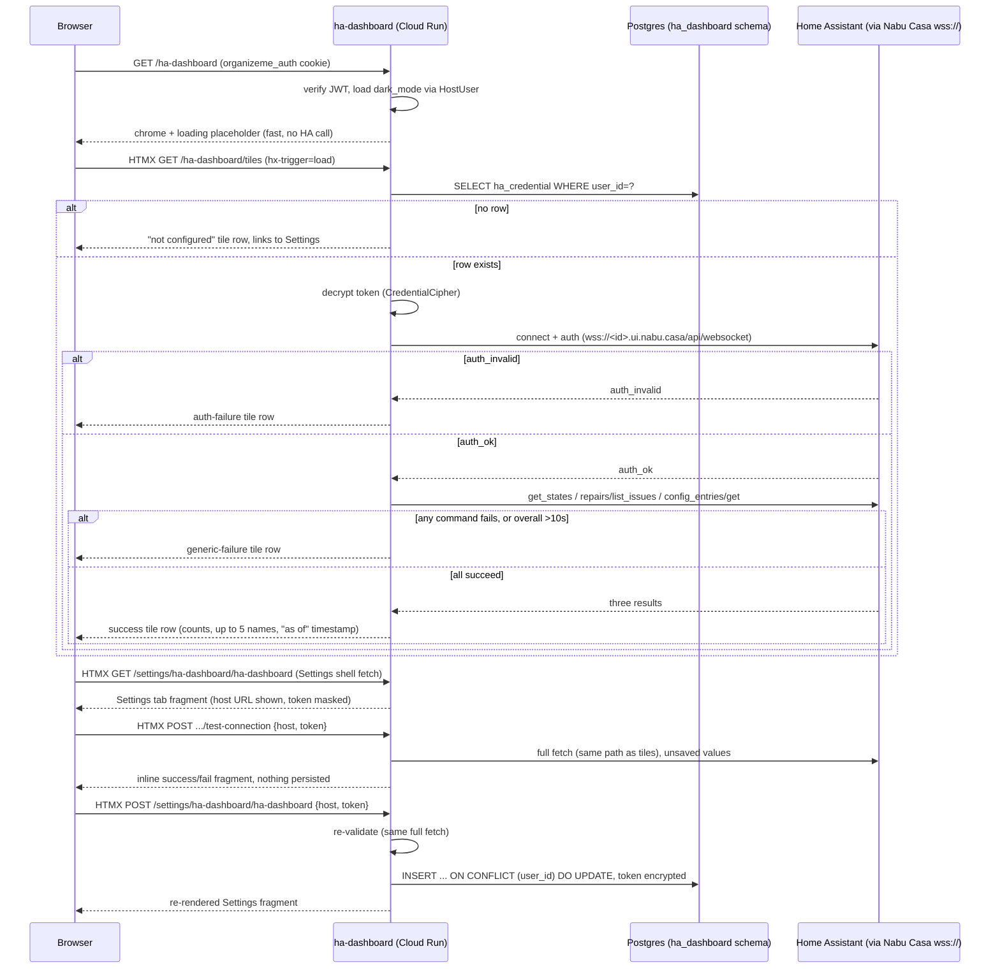

# HA Dashboard — Technical Design

**Feature:** [`PRD.md`](PRD.md)
**Date:** 2026-07-23
**Status:** Draft

## Architecture at a Glance

- New standalone repo `ha-dashboard` (once scaffolded via `/new-hosted-app`), FastAPI + async
  SQLAlchemy + Alembic, structured as a trimmed `doc-library`-shaped layout — but with one
  dedicated `app/services/ha_client/` package for the Home Assistant WebSocket integration, which
  doc-library's "no `services/`" precedent doesn't cover (see
  [ADR: HA client module boundary](../../adr/ha-dashboard-ha-client-module-boundary.md)).
- One table, `ha_dashboard.ha_credential` — **per-user**, one row per Host user, matching the
  platform's standard Settings-tab-backed data shape (see
  [ADR: credential storage](../../adr/ha-dashboard-credential-storage.md)). Token encrypted at
  rest via a ported `CredentialCipher`, keyed by the platform's existing shared `ENCRYPTION_KEY`
  secret.
- No login/session code of its own — verifies the Host's JWT cookie via
  `organizeme_chrome.jwt_verify`, same as every other hosted app.
- **Shell-then-fragment rendering**: `GET /ha-dashboard` returns instantly with chrome + a loading
  placeholder; the actual ~10s-bounded WS fetch happens in a separate HTMX fragment route
  (`hx-trigger="load"`), which is the only way the PRD's required loading-spinner behavior (user
  story 12) is achievable — an inline synchronous fetch on the page route would block the whole
  page load.
- No QA Cloud Run environment (per the PRD) — a CI-level Docker build + migration smoke test
  substitutes for what QA would otherwise catch on the deploy-pipeline side (see
  [ADR: no QA environment](../../adr/ha-dashboard-no-qa-environment.md)).
- No JSON API surface at all (`app/api/v1/` omitted app-wide) — every route is either a full page
  or an HTMX fragment; nothing else consumes this app's data.

## Design Decisions

### Module layout

```
app/
  core/
    auth.py          — current_user_id / current_user_id_optional, ported verbatim
    config.py         — Settings: encryption_key, ha_fetch_timeout_seconds (default 10)
    security.py        — CredentialCipher, own copy ported from event-creator's app/core/security.py
    templating.py, nav.py
  db/{base,session,url}.py
  models/
    host_user.py       — read-only cross-schema mapping (id, dark_mode), select-only
    ha_credential.py    — the per-user table + get/upsert query functions (thin, no service wrapper)
  schemas/
    ha_credential.py     — Read (masked — never returns the token), Write, TestConnectionRequest
    ha_summary.py          — HASummary / UpdateItem / RepairIssue / IntegrationError (parsed WS output)
  services/
    host_user.py           — thin dark_mode lookup, ported from doc-library
    ha_client/
      client.py             — HAWebSocketClient: connect, auth, 3 commands, one 10s timeout budget
      transport.py            — HATransport protocol — the test seam (see Testing Approach)
      errors.py                — HAAuthError / HAConnectionError (the two-bucket failure taxonomy)
  pages/
    dashboard.py             — GET /ha-dashboard (shell), GET /ha-dashboard/tiles (fragment, real fetch)
    settings_fragments.py     — GET tab fragment, POST test-connection, POST save
```

Rationale for `app/services/ha_client/` despite doc-library's precedent, and for keeping
`ha_credential.py`'s persistence as a plain query module rather than another service: see the
[module boundary ADR](../../adr/ha-dashboard-ha-client-module-boundary.md). In short —
`event-creator`'s `app/services/storage/` (an external-system gateway) is the closer precedent
here than doc-library's CRUD-only shape; the service layer is scoped to the one concern that
actually has orchestration/failure-mapping logic, not applied app-wide.

### Credential schema

`ha_dashboard.ha_credential`:

| column | type | notes |
|---|---|---|
| `id` | UUID PK | `default=uuid.uuid4` |
| `user_id` | UUID, `FK host.users.id` | `ON DELETE CASCADE`, `UNIQUE` — one row per user |
| `ha_host_url` | text, not null | plaintext — not a secret, it's the same URL tiles deep-link to |
| `encrypted_token` | bytea/text, not null | Fernet ciphertext via `CredentialCipher` |
| `last_tested_at` | timestamptz, null | set on a successful Test Connection or save; debugging aid |
| `updated_at` | timestamptz | `onupdate=func.now()` |

Save is an atomic per-user `INSERT ... ON CONFLICT (user_id) DO UPDATE`, never check-then-insert,
so there's no race window if the same user saves from two tabs concurrently. "Configured for this
user?" is simply "does a row with their `user_id` exist" — no separate boolean flag needed. Every
read/write resolves `user_id` from `current_user_id` (the verified JWT), never from the request
body — a row that doesn't belong to the requesting user is invisible to them, same 404-not-403
convention `doc-library` uses. Full rationale (including why a global singleton was considered and
rejected, and why the host URL specifically isn't encrypted) in the
[credential storage ADR](../../adr/ha-dashboard-credential-storage.md).

`ENCRYPTION_KEY` is the platform's existing shared Secret Manager secret
(`encryption-key-prod` — no QA counterpart needed), not a new `ha-dashboard`-specific key.

### HA WebSocket client

- One entry point, `fetch_dashboard_summary(host, token) -> HASummary`, run inside a single
  `asyncio.wait_for(..., timeout=10)` covering the whole connect→auth→3-command exchange — the
  timeout is enforced app-side, not left to Cloud Run's own (300s default) request timeout, so a
  hung Nabu Casa connection fails fast and predictably instead of tying up the request for minutes.
- Internally raises only two exception types out of the client: `HAAuthError` (the WS `auth_invalid`
  response) and `HAConnectionError` (everything else — timeout, connection refused, malformed
  response, and, per the decision below, a permission-denied-shaped failure on an individual
  command). Nothing HA-protocol-specific crosses this boundary; the route layer only ever sees one
  of these two exceptions or a successful `HASummary`.
- **Any single command failing collapses the whole fetch to a failure**, never a partial-success
  render — resolves an edge case none of the three review passes could leave implicit: a valid but
  non-admin token could plausibly pass the initial `auth_ok` handshake and then fail specifically
  on `config_entries/get` (which requires admin-level access) with something that's neither a clean
  `auth_invalid` nor a connection/timeout error. That case is bucketed as `HAConnectionError`
  (generic failure), not `HAAuthError` — the credential *did* authenticate; it just isn't
  privileged enough for one of the three commands. This matches the PRD's explicit "no further
  breakdown of failure causes" — the generic-failure tile is the right home for it, and the
  underlying detail is still available in server-side logs for you to debug from, even though the
  user-facing message doesn't distinguish it.
- **Presentation stays out of the client.** `HASummary`/`UpdateItem`/`RepairIssue`/
  `IntegrationError` carry full, untruncated data — the 5-name cap, "+N more", and zero-count
  "all clear" styling are all decided in the route/template layer, not the client. The
  `translation_key` fallback for a repair issue with no readable title is the one exception: it's
  encoded as a schema-level default on `RepairIssue` (so every consumer gets a guaranteed non-empty
  string), not re-implemented at the template layer.
- **Testability seam**: `HAWebSocketClient` takes an injectable `HATransport` (protocol: `send`,
  `recv`, async-context-manager connect/close) rather than importing `websockets` directly. The
  production implementation wraps `websockets.connect`; tests use a scripted `FakeHATransport` fed
  ordered (expected-send, canned-recv) pairs matching HA's real message shapes — this is what lets
  the PRD's stated "mocked/fake WebSocket server" test approach survive refactors, rather than
  patching `websockets.connect` directly and coupling every test to that library's exact API.
- **Test Connection reuses the full fetch, not just the auth handshake.** The PRD's literal
  wording ("performs the same WS auth handshake") would let a non-admin token pass Test Connection
  and then still fail the integrations tile on every real dashboard load — defeating the PRD's own
  stated intent (user story 18: catch a bad token *before* it causes a dashboard error). Test
  Connection therefore runs the identical `fetch_dashboard_summary()` call the dashboard fragment
  uses, under the same 10s budget, and reports success/failure without persisting anything. This
  is a deliberate, scoped refinement of the PRD's phrasing in service of its stated goal, not a
  scope expansion — flagged here so it isn't mistaken for a mismatch during implementation.
- Save-time re-validation: the save endpoint independently re-runs the same validation rather than
  trusting a prior "Test Connection succeeded" flag from the client — Test Connection and Save are
  separate requests, and the token field can be edited in between.

### Routes and registry entry

- `GET /ha-dashboard` — page shell. `current_user_id_optional`; redirects to `/login` if
  unauthenticated. Renders chrome + a loading placeholder only — no WS fetch happens on this route.
  This is the one route that needs `dark_mode` threaded into `theme_attr()` (via the same
  `HostUser`/`get_dark_mode()` pattern doc-library uses) — the fragments below are partials swapped
  into an already-chromed page and don't re-render chrome, so they don't need it.
- `GET /ha-dashboard/tiles` — HTMX fragment, `hx-trigger="load"` from the shell. Does the actual
  fetch and renders one of the four tile-row states:
  - **Not configured** — no credential row exists for the requesting user — links to Settings.
  - **Success** — the three tiles, timestamp, truncation/all-clear styling applied here.
  - **Auth failure** — `HAAuthError` — "Home Assistant rejected the token."
  - **Generic failure** — `HAConnectionError` (timeout, unreachable, malformed response, or a
    non-admin-token permission failure per the decision above) — one generic message.
- `GET /settings/ha-dashboard/ha-dashboard` — Settings tab fragment (id matches
  `SettingsTab("ha-dashboard", ...)`).
- `POST /settings/ha-dashboard/ha-dashboard/test-connection` — validates submitted (unsaved)
  host/token via the full fetch; returns an inline success/fail fragment; never persists.
- `POST /settings/ha-dashboard/ha-dashboard` — upserts the requesting user's credential row
  (`user_id` from `current_user_id`) after independently re-validating.

Registry entry (`organize-me`'s `app/core/registry.py` `APPS` list — registry-decoupling moved
this out of the versioned `organizeme_chrome` package; see `docs/how-to-add-a-hosted-app.md`):

```python
AppEntry(
    service_name="ha-dashboard",
    nav=[AppNavItem("/ha-dashboard", "HA Dashboard")],
    settings_tabs=[SettingsTab("ha-dashboard", "HA Dashboard")],
    api_prefixes=["/ha-dashboard/tiles", "/settings/ha-dashboard"],
),
```

**Concrete LB gotcha to avoid** (the same class of bug as issue #178): `generate_url_map.py` gives
`nav` paths an **exact-match-only** rule — no automatic wildcard. Only `api_prefixes` entries get
both the bare path and a `/*` wildcard. Without `/ha-dashboard/tiles` and `/settings/ha-dashboard`
explicitly listed in `api_prefixes` (as above), those routes fall through to the Host as
`defaultService` and 404 — `AppNavItem("/ha-dashboard", ...)` alone is not enough.

### Deployment / Cloud Run

- Request-based billing throughout — no `--no-cpu-throttling`, no `--min-instances`, consistent
  with the platform's hard default and ADR `0001-event-creator-worker-cpu-throttling`'s reasoning.
  A ~10s outbound WS call inside one request handler is ordinary request work, not background work.
- No `--timeout` override needed — Cloud Run's 300s default request timeout has ample headroom over
  the 10s app-enforced fetch budget; a shorter, "this is a fast dashboard" custom timeout would be
  the wrong direction and risks clipping the one legitimately slow path.
- No VPC Serverless Access Connector needed — default Cloud Run networking already permits outbound
  `wss://` to the public internet (Nabu Casa needs no static/allowlisted egress IP as far as this
  session's research found).
- Each request opens its own WS connection and tears it down (`async with`) — no pooling/reuse
  across requests. This isn't a missed optimization: the PRD wants a fresh fetch every load, HA's
  WS API re-authenticates per connection, and a Cloud Run instance can scale to zero between
  requests anyway, so a pooled connection wouldn't reliably survive to be reused.
- `--set-secrets=JWT_SECRET=jwt-secret-prod:latest,ENCRYPTION_KEY=encryption-key-prod:latest` on
  the (only) prod deploy step — no QA counterpart, see the
  [no-QA-environment ADR](../../adr/ha-dashboard-no-qa-environment.md) for the CI-level mitigation
  that substitutes for what a QA Cloud Run tier would otherwise validate.
- Failure isolation: a Nabu Casa or home-internet outage only ever affects the one request
  rendering `/ha-dashboard/tiles` (a bounded ~10s failure, then a generic-failure tile) — no shared
  DB connection, Cloud Run service, or Cloud Tasks queue is touched, so the Host and every other
  hosted app are completely unaffected.

## Component/Data Flow



## Testing Approach

- Good tests here exercise observable behavior at real seams — HTTP responses and rendered
  tile/error/settings states, and the WS client's parsing/failure-mapping logic against a scripted
  fake transport — not internal function calls or a live Home Assistant instance.
- **`HAWebSocketClient` unit tests** (`tests/test_ha_client.py`) — drive `HATransport` fakes
  through: happy path (`get_states`/`repairs/list_issues`/`config_entries/get` correctly filtered
  into `HASummary`), `auth_invalid` → `HAAuthError`, timeout → `HAConnectionError`, malformed
  response → `HAConnectionError`, a command-level permission failure after successful auth →
  `HAConnectionError` (per the bucketing decision above). No live HA token in CI.
- **Page-route tests** (`tests/test_dashboard_page.py`), `httpx.AsyncClient` against the real app +
  real test Postgres, `HAWebSocketClient` dependency overridden with a fake: unauthenticated
  redirects to Host login; `GET /ha-dashboard` renders the shell fast without waiting on HA;
  `GET /ha-dashboard/tiles` renders each of the four states; 6+ items truncate to 5 + "+N more";
  zero-count tiles get the "all clear" styling; `dark_mode` flows through on the shell route only.
- **Settings tests** (`tests/test_ha_credential_settings.py`) — same HTTP-level pattern: saving
  valid host/token persists an encrypted row, reflected on the next tiles fetch; Test Connection
  surfaces failure without persisting; the token is never present in plaintext in any response
  body (settings fragment, JSON, or otherwise); a second save by the same user overwrites their own
  row rather than creating a second one; one user's credential is never visible or editable via
  another user's session (matching `doc-library`'s "never another user's row, even by guessing an
  id" coverage).
- **Model-level test** (`tests/test_ha_credential_model.py`) — concurrent upsert behavior on one
  user's row (two near-simultaneous saves by the same user resolve to one row, last-write-wins, no
  unique-constraint violation), matching the atomic-upsert decision above; plus an `ON DELETE
  CASCADE` test against `host.users`, matching the platform's standard cross-schema cascade
  coverage (`doc-library`'s `test_doc_link_model.py`).
- **CI pipeline smoke test** (per the [no-QA ADR](../../adr/ha-dashboard-no-qa-environment.md)) —
  build the prod image, run it against a throwaway CI-local Postgres, run `alembic upgrade head`,
  hit the health check — before the prod deploy step, substituting for what a QA Cloud Run tier
  would otherwise catch on the pipeline/migration side.
- **Manual/live verification** (not automated, before each deploy): browser click-through against
  the real Home Assistant instance — loading state, correct tile data, deep-links landing on the
  right HA page, error tile on a deliberately bad token, Test Connection against a real non-admin
  token to confirm it correctly fails.
- No boundary/e2e spec anticipated beyond the platform's existing generic Host↔hosted-app
  auth-trust pattern — revisit only if an ha-dashboard-specific auth edge case turns up.

## Open Questions

1. **Confirm `config_entries/get`'s admin requirement fails in a way this design's bucketing
   assumes.** This session's research confirmed the command exists and is generally understood to
   need an admin-level token, but didn't source-verify the *exact* WS error shape HA returns for a
   valid-but-non-admin token on that specific command. If it turns out to auth-reject at the
   handshake level instead of failing the individual command, the bucketing decision above (generic
   failure, not auth failure) may need revisiting — worth a quick spike against a real non-admin
   LLAT early in `/to-implementation`, not just assumed from this design.
2. **CI smoke-test job specifics** (exact throwaway-Postgres mechanism — a service container vs.
   `testcontainers` vs. SQLite-for-migration-only — and where it slots into the existing CI
   workflow shape) are left for `/to-wbs`/`/to-implementation` to settle against whatever
   `/new-hosted-app` actually scaffolds for this repo's CI.
