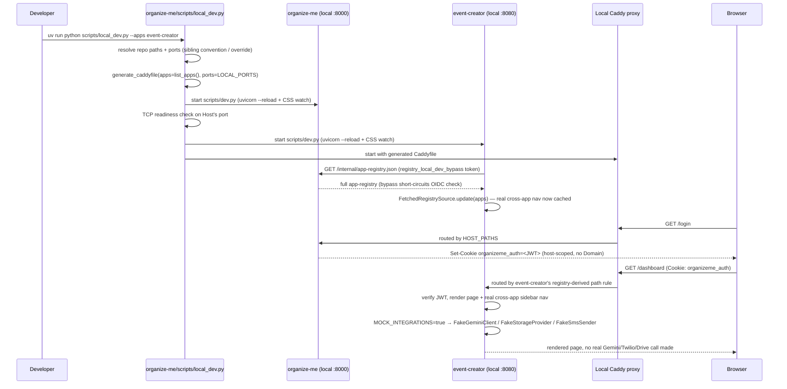

# Local Development Environment — Technical Design

**Feature:** [`PRD.md`](PRD.md)
**Date:** 2026-07-25
**Status:** Draft

## Architecture at a Glance

- Every app repo (`organize-me`, `event-creator`, `doc-library`, `ha-dashboard`) gains its own
  conventional `scripts/dev.py` that starts *itself* (its `uvicorn --reload` + its
  `build_css.py --watch`) for local dev. `organize-me` gains a new orchestrator,
  `scripts/local_dev.py`, that discovers a chosen subset of sibling repos, invokes each one's own
  `scripts/dev.py` as a subprocess, starts a local Caddy reverse proxy, and multiplexes every
  subprocess's output with a color-coded per-service prefix.
- A new `infra/local_dev/generate_caddyfile.py` (companion to the existing
  `infra/gcp_lb/generate_url_map.py`) turns the app-registry plus a new local-only port-mapping
  config (`infra/local_dev/ports.py`) into a Caddy config, giving the developer one shared local
  origin — the local stand-in for the real Load Balancer. Both generators share the same
  path-rule-derivation logic, extracted into a new provider-neutral `infra/path_rules.py`.
- Real login only: the developer authenticates through a locally-running Host exactly as in
  QA/prod; no code changes are needed for the JWT/SSO cookie itself (it's already host-scoped, not
  port- or domain-scoped, so it already crosses `localhost:<port>` boundaries).
- A previously-undiscovered, load-bearing gap gets fixed as part of this feature: the registry-sync
  HTTP call every hosted app makes to the Host currently always fails locally (real OIDC required,
  GCP metadata server unreachable off real GCP infra) — every hosted app has therefore only ever
  served its own cold-start self-only registry entry when run locally, meaning cross-app nav has
  never actually worked outside a real deployment. A Host-controlled, fail-safe local-dev bypass
  (never asserted by the caller) fixes this so the real fetch/cache/refresh mechanism gets
  exercised locally too, not skipped.
- A new `mock_integrations` setting (independent of the existing `E2E_TEST_MODE` flag) lets a
  developer swap in each app's existing (or, in two cases, newly-built) fake implementation of a
  costly/side-effecting third-party integration — Gemini, Twilio, Resend, OAuth storage providers,
  Home Assistant — without needing every real credential.
- The local database is untouched: every app keeps connecting directly to the shared QA Supabase
  instance, exactly as already documented.

## Design Decisions

### Local process orchestration

Each app repo owns a `scripts/dev.py` declaring how to start itself (dev server + CSS watcher,
port read from an environment variable). `organize-me`'s new `scripts/local_dev.py` is a pure
orchestrator: it never hardcodes another repo's literal run command, only discovers its path,
looks up its port, and invokes its own `scripts/dev.py`. See
[`docs/adr/local-dev-environment-launcher-orchestration-boundary.md`](../../adr/local-dev-environment-launcher-orchestration-boundary.md).

- **Repo discovery:** sibling-directory convention (`../event-creator`, `../doc-library`,
  `../ha-dashboard`), overridable per app via an environment variable (e.g.
  `EVENT_CREATOR_REPO_PATH`) so a developer can point at a git worktree holding an in-progress
  branch instead of the main checkout.
- **App selection:** `scripts/local_dev.py` accepts an optional list of service names; with none
  given, it starts every hosted app repo it finds present on disk (resolved via the discovery rule
  above).
- **Failure handling** (deliberately minimal for a local dev tool — see the microservices review):
  a port already in use fails that one app's startup with a clear labeled error but doesn't stop
  the others; a subprocess crashing is logged with its exit code and everything else (including
  Caddy) keeps running; there's no dependency-install preflight check, no auto-restart, and no
  auto port-reassignment — all of that would be overengineering relative to what a thin local tool
  needs. On shutdown (Ctrl-C), every child process, including Caddy, is terminated, so a stray
  process can't cause the *next* session's port-in-use failure.
- **Console output:** each subprocess's stdout/stderr is relayed with a per-service color-coded
  prefix (e.g. `[event-creator] ...`). No application-level logging changes anywhere — every app
  already logs via plain `logging.getLogger()` with no Cloud-specific handler, so console output
  already works locally as-is; this is purely the launcher's own output-relay concern.
- **Startup ordering:** the launcher does a simple TCP-connect readiness check on the Host's own
  port before starting the other subprocesses, so a hosted app's first registry-refresh attempt
  (see below) doesn't race the Host's own startup and then sit on a full refresh-interval wait
  before retrying.

### Local reverse proxy & registry-driven routing generation

Caddy, bound to a configurable non-privileged default port, presents one shared local origin.
Its config is generated — never hand-maintained — from the same app-registry data
`generate_url_map.py` already reads, plus the new port-mapping config. See
[`docs/adr/local-dev-environment-local-reverse-proxy.md`](../../adr/local-dev-environment-local-reverse-proxy.md).

- `infra/path_rules.py` (new): the pure `PathRule`/`generate_path_rules`/`_claim_path`/
  `_prefix_patterns` logic extracted out of `infra/gcp_lb/generate_url_map.py`, so both the real
  LB generator and the new local generator derive routing from one shared implementation.
- `infra/local_dev/generate_caddyfile.py` (new): `generate_caddyfile(apps, ports) -> str`, a pure
  function over the *entire* registry (not the launcher's session-selected subset) and the port
  map, mirroring the existing generator's own purity and test style. An app the developer didn't
  start that session surfaces as a clean connection-refused/502 through Caddy — correct, legible
  behavior, not a gap to special-case around.
- `infra/local_dev/ports.py` (new): a plain Python module (consistent with `AppEntry` already
  being plain Python, and directly unit-testable) mapping each `service_name` to its local port.
  Deliberately kept separate from the shared `AppEntry` dataclass — see the ADR for why.
- Each `PathRule`'s paths are emitted as literal Caddy `path` matchers rather than collapsed into
  Caddy-specific shorthand, since Caddy's wildcard-matching semantics aren't guaranteed identical
  to GCP's (the existing generator's `_prefix_patterns()` docstring already documents one
  GCP-specific gotcha caught in review — don't assume parity anywhere else either).
- `event-creator`'s SSE endpoint (`GET /api/v1/processing-runs/{run_id}/sse`) needs an explicit
  non-buffering/flush directive in the generated Caddy config, or processing-run progress updates
  will arrive in one lump instead of streaming. `ha-dashboard`'s WebSocket connection to Home
  Assistant is strictly outbound from that process and is never proxied through Caddy, so no
  WS-upgrade handling is needed in the generated config.
- Plain HTTP (no TLS) is correct for the local proxy — `app/auth/backend.py`'s existing comment
  already establishes that `cookie_secure=True` works over `http://localhost` since browsers treat
  it as a secure context regardless.

### Registry sync across the local process boundary

The single most load-bearing gap this design closes: `_verify_registry_read_token`
(`app/api/internal/registry.py`) fails closed (503) locally by default, and the client-side
default token provider needs the GCP metadata server — so cross-app nav has never actually worked
when any hosted app runs locally, independent of anything else in this feature. See
[`docs/adr/local-dev-environment-registry-sync-auth-bypass.md`](../../adr/local-dev-environment-registry-sync-auth-bypass.md)
for the full decision and rejected alternatives.

- New Host setting `registry_local_dev_bypass: bool = False`. `_verify_registry_read_token` checks
  it first, before reading any `Authorization` header, and short-circuits if true.
- Fail-safe guard: Host startup raises if `registry_local_dev_bypass` is true while Cloud Run's own
  `K_SERVICE` environment variable is present, converting "bypass left on in a real deployment"
  into a boot-time crash.
- Each consumer app gets a matching `registry_local_dev_bypass` setting. When true: `
  registry_host_url` is set (by the launcher) to the Host's local port directly, bypassing the
  local Caddy proxy for this one server-to-server call — mirroring how this value already bypasses
  the real Load Balancer in QA/prod — and `registry_client.py` gains a new
  `build_local_dev_token_provider()` (a constant placeholder string, no metadata-server round
  trip) selected instead of `build_default_token_provider()` in each consumer's `_refresh_loop`.
- All of these settings/env vars are set by the launcher itself as subprocess environment
  variables, never hand-added to a developer's `.env.local`.
- A dedicated test asserts the bypass is inert whenever `registry_endpoint_url`/
  `registry_invoker_service_account` are populated, so the real and bypassed paths can never both
  be "on."

### Mock integrations

See
[`docs/adr/local-dev-environment-mock-integrations-flag.md`](../../adr/local-dev-environment-mock-integrations-flag.md)
for the full decision. Concretely, per app:

- **`event-creator`:** add `mock_integrations: bool = False` to `Settings`.
  `build_storage_provider()` (`app/services/storage/factory.py`) and the Gemini client factory
  (`app/services/llm/gemini.py`) each gain one additional `or settings.mock_integrations` clause
  alongside their existing `e2e_test_mode` check — both already select an existing fake
  implementation, so this is a small, low-risk change. `get_pipeline_notifier()`
  (`app/services/notifications/pipeline.py`) currently has **no** real/fake branch at all — this
  needs a new branch added, selecting `FakeSmsSender`/the fake email sender when
  `mock_integrations` (or `e2e_test_mode`) is true.
- **`ha-dashboard`:** add `mock_integrations: bool = False` to `Settings`. Its HA-transport
  selection is currently a bare constructor default
  (`transport_factory: HATransportFactory = WebSocketsHATransport`), not a settings-driven choice —
  this needs a new `build_ha_transport_factory(settings) -> HATransportFactory` function, and its
  `FakeHATransport` (currently defined only in that repo's own test suite) needs promoting into
  application code (e.g. alongside where `event-creator`'s other fakes already live in
  `app/services/`), so it can be selected outside of tests.
- **`doc-library`:** no change — it has no third-party integration to mock.
- No shared cross-repo abstraction is introduced for this; the convention (add the flag, OR it
  into your own real-vs-fake selection point) is documented once in
  `how-to-add-a-hosted-app.md`, not encoded in `organizeme_chrome`.

### Auth / SSO cookie

No design work needed here beyond confirming the existing mechanism already supports this: `
app/auth/backend.py` sets no `cookie_domain` locally (`COOKIE_DOMAIN` is unset by default), and
cookies are scoped by host, not port, so a JWT issued by a locally-running Host at `localhost:8000`
is already sent by the browser to a hosted app at `localhost:8080` (or, once Caddy is in place,
through the shared proxy origin) with zero code changes. The developer logs in through the real
`/login` flow; no bypass or mock-JWT path is introduced.

## Component/Data Flow

## Testing Approach

- **`infra/path_rules.py` / `infra/local_dev/generate_caddyfile.py`:** pure-function unit tests
  against constructed `AppEntry`/`AppNavItem` objects, no real Caddy binary, filesystem, or
  subprocess — directly mirroring `tests/test_url_map_generator.py`'s existing style. Include a
  case asserting the generator includes rules for an app that isn't in the launcher's
  session-selection at all (proving it's a pure function of the whole registry).
- **`infra/local_dev/ports.py` and repo-path resolution:** unit tested as pure functions (given a
  service name and a set of inputs/env vars, resolve the port/path to use), no real filesystem or
  subprocess dependency needed beyond simple constructed inputs.
- **The registry-fetch local-dev bypass:** a direct test of `_verify_registry_read_token` asserting
  (a) it short-circuits when `registry_local_dev_bypass` is true and no token is present, and (b)
  it is inert — falls through to the real OIDC check — whenever `registry_endpoint_url`/
  `registry_invoker_service_account` are populated, so the bypass and the real path can never both
  be active. Mirrors `tests/test_internal_registry.py`'s existing structure. A second test on the
  startup-guard raises when `registry_local_dev_bypass` is true and `K_SERVICE` is set.
- **`mock_integrations` wiring:** tested exactly the way each app already tests its
  `E2E_TEST_MODE`-driven fake-provider selection — a direct test of the factory/provider-selection
  function asserting it returns the fake implementation when `mock_integrations` is set and the
  real implementation otherwise. `event-creator`'s existing `tests/test_storage_factory.py` and
  `tests/test_gemini.py` are the direct prior art to extend; the new `get_pipeline_notifier()`
  branch and `ha-dashboard`'s new `build_ha_transport_factory()` need equivalent new tests
  following the same shape.
- **The launcher's own process-orchestration behavior** (starting/stopping subprocesses, output
  relaying/prefixing) is explicitly lower-value to unit test exhaustively — prefer a thin,
  manually-verified check (documented in the relevant implementation slice) over mocking
  subprocess machinery extensively.
- No changes are needed to any deployed-environment (QA/prod) test suite — every new flag defaults
  to `False`/unset, so none of this new behavior is reachable unless explicitly turned on.

## Open Questions

- **Exact Caddy default port and installation method.** A specific non-privileged port number and
  whether the launcher should attempt to auto-install/detect the Caddy binary (vs. documenting a
  one-time manual install) needs a concrete answer before implementation — flagged for
  `/to-wbs`/`/to-implementation` rather than blocking this design.
- **`scripts/dev.py`'s exact CLI surface** (how it receives its port — env var vs. argument — and
  whether it also needs a `--no-css-watch` escape hatch) is left to the implementing slice; the
  ADR only fixes the boundary (each app owns this script), not its interface.
- **Whether `how-to-add-a-hosted-app.md` and `secrets-and-accounts.md` need a new "local dev"
  section added as part of this feature's own slices**, versus a follow-up doc pass — recommend
  folding it into whichever slice adds the port-mapping config, since that's the file a new app's
  author needs to touch anyway.
- **Whether the existing `APP_ENV=local` value already documented in `organize-me`'s
  `.env.local.example` (currently unused — not read by `Settings` anywhere) should be wired up as
  part of this feature** (e.g. as an alternate/simpler gate for `registry_local_dev_bypass`) or
  left alone as unrelated, pre-existing dead documentation — worth a quick decision at
  `/to-wbs` time so it's not accidentally load-bearing for two different things.
