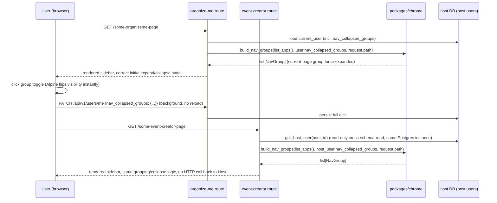

# Sidebar Nav Groups — Technical Design

**Feature:** [`PRD.md`](PRD.md)
**Date:** 2026-07-16
**Status:** Draft

## Architecture at a Glance

- Grouping/collapse-state combination logic lives as a small, pure function in `packages/chrome`
  (new module `organizeme_chrome/nav_groups.py`):
  `build_nav_groups(apps: list[AppEntry], collapsed: dict[str, bool], current_path: str) -> list[NavGroup]`.
  Pure data in, pure data out — no `Request`, no DB, no Jinja coupling, so it's reusable and
  independently testable from both consuming services.
- Each service (`organize-me`'s own routes, and separately `event-creator`'s routes) calls this
  function per-request — fetching its own current user's `nav_collapsed_groups` and current path —
  and passes the result into template context as an ordinary variable.
  `templating.py::register_chrome()` stays env-setup-time only; it registers the function/module
  for import, it does not try to hold per-request state in a Jinja global. See
  [ADR: render boundary](/docs/adr/sidebar-nav-groups-render-boundary.md).
- Settings/Profile keep rendering as flat items outside any group, derived structurally from the
  existing `organizeme` `AppEntry`'s nav — no new registry fields, per the PRD's constraint.
- Group display labels are humanized from `service_name` inside `packages/chrome` (e.g.
  `"event-creator"` → `"Event Creator"`), not added as a new `AppEntry` field.
- New `User.nav_collapsed_groups: dict[str, bool]` column (JSON, default `{}`) added to the Host
  DB only; the existing `PATCH /api/v1/users/me` endpoint gains the field, following the
  `dark_mode` contract exactly (partial update, explicit-null rejected, full-dict replace on write).
- `event-creator`'s `HostUser` mapping gains the same column (read-only), and every one of its
  chrome-rendering page routes is wired to actually read and use it — establishing, for the first
  time, a real working Host-preference-sync pattern in that service. See
  [ADR: cross-repo sync](/docs/adr/sidebar-nav-groups-cross-repo-sync.md).

## Design Decisions

### 1. Render-state boundary

Combining the static registry, the user's stored preference, and the current request's path is
done by a pure function in `packages/chrome`, called per-request by each consuming service's own
route/dependency layer — not baked into `register_chrome()`'s env-setup-time Jinja globals, and
not implemented as branching logic inside templates. Full reasoning and alternatives:
[ADR: sidebar-nav-groups-render-boundary](/docs/adr/sidebar-nav-groups-render-boundary.md).

### 2. Persistence shape

```python
from sqlalchemy import JSON
from sqlalchemy.ext.mutable import MutableDict

nav_collapsed_groups: Mapped[dict[str, bool]] = mapped_column(
    MutableDict.as_mutable(JSON), default=dict, server_default="{}"
)
```

`MutableDict` wrapping is defensive: the feature's write path always replaces the whole dict on
every `PATCH` (per the PRD — clients send the full updated dict, not a delta), so in-place-mutation
tracking isn't exercised today, but it costs nothing and protects against a future call site that
patches a single key and silently no-ops without it. Plain `JSON`, not `JSONB` — there's no
existing Postgres-specific typing precedent in `app/models`, and nothing in this feature queries
inside the JSON blob.

### 3. Schema validation

```python
# UserRead
nav_collapsed_groups: dict[str, bool] = {}

# UserUpdate
nav_collapsed_groups: dict[str, bool] | None = None
```

Reuses the existing `_reject_explicit_null`-style validator so `{"nav_collapsed_groups": null}`
still 422s, matching `dark_mode`'s and `email`'s existing behavior. Dict keys are **not** validated
against real registry `service_name`s at the schema layer — an unrecognized key simply matches no
group at render time (handled naturally by `build_nav_groups()`), which keeps `app/schemas/user.py`
decoupled from `organizeme_chrome.registry`.

### 4. Migration

Single Host-only migration, following the existing `add_*` naming convention:

```python
def upgrade() -> None:
    op.add_column(
        "users",
        sa.Column("nav_collapsed_groups", sa.JSON(), nullable=False, server_default="{}"),
        schema="host",
    )

def downgrade() -> None:
    op.drop_column("users", "nav_collapsed_groups", schema="host")
```

event-creator's Alembic `include_object` filter (`event-creator/migrations/env.py:29-41`) already
excludes `schema="host"` from its own migration history, so this migration only ever runs against
the Host DB — confirmed no event-creator migration-history impact.

### 5. Cross-repo propagation

`packages/chrome` changes ship as a new git tag (next after `chrome-v0.4.0`), and event-creator's
`pyproject.toml` pin is bumped to it in the same implementation pass as event-creator's own
`HostUser`/route-wiring changes below — not left pointing at the old tag. Full reasoning and
alternatives: [ADR: sidebar-nav-groups-cross-repo-sync](/docs/adr/sidebar-nav-groups-cross-repo-sync.md).

### 6. event-creator wiring

- Extend `event-creator/app/models/host_user.py`'s `HostUser` mapping with `nav_collapsed_groups`
  (read-only), mirroring how `dark_mode` is already mapped there.
- Every page route currently rendering chrome (`dashboard.py`, `logs.py`, `processing.py`,
  `prompt.py`, `upload.py`) is updated to call `get_host_user()` and pass the real
  `nav_collapsed_groups` value through `build_nav_groups()` with that route's own current path —
  not a hardcoded default, the way `dark_mode` currently is in those same routes.
- This feature does **not** also fix `dark_mode`'s existing hardcoded-default gap in those routes —
  out of scope, avoid scope creep into unrelated existing behavior.

## Component/Data Flow



## Testing Approach

- **`packages/chrome`**: new unit tests for `build_nav_groups()` as a pure function — plain
  dicts/lists in, `NavGroup` list out, no `Request`/DB fixtures needed. This is the main new test
  surface for this feature, since it's genuinely new logic.
- **`tests/test_users.py`** (Host repo): extend with `nav_collapsed_groups` cases mirroring the
  existing `dark_mode` coverage — `test_patch_dark_mode_persists`,
  `test_patch_partial_update_leaves_other_fields_unchanged`,
  `test_patch_with_explicit_null_dark_mode_returns_422` — plus a new explicit case asserting a
  second `PATCH` fully replaces (not merges) the stored dict, since that contract is easy to
  accidentally implement as a merge later. Same `httpx.AsyncClient` + rolled-back-DB integration
  style as existing tests (`tests/conftest.py`).
- **Template-rendering test** (extending `tests/test_profile_page.py`'s pattern, or a new
  `tests/test_sidebar_nav_groups.py`): asserts grouped HTML structure, correct `aria-expanded`
  values per stored state, current-page force-expand without persisting the override, and that
  Settings/Profile always render outside any group container regardless of any group's state.
- **event-creator repo**: route-level test(s) confirming `nav_collapsed_groups` is actually read
  from `HostUser`/`get_host_user()` and passed through — not hardcoded — for at least one
  representative page route, as the pattern to replicate across the remaining four during
  implementation.
- **Out of scope for automated coverage**: visual/animation details (chevron rotation, spacing),
  cross-browser Alpine behavior — left to manual verification per the project's existing UI-change
  practice.

## Open Questions

- Exact next `packages/chrome` git tag/version number — pick at implementation time following
  whatever versioning convention `chrome-v0.4.0` established.
- Whether event-creator's five-route wiring lands as one slice or is split across multiple — a WBS
  granularity call for `/to-wbs`, not resolved here.
- Confirmed scope boundary (recorded here to prevent drift during slicing): `dark_mode`'s existing
  hardcoded-default gap in event-creator is explicitly **not** fixed as part of this feature.
