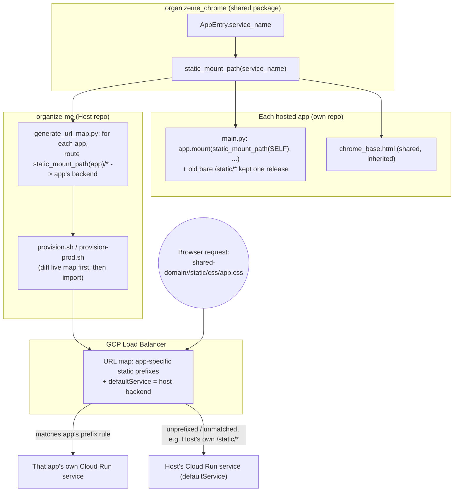

# Static Asset Routing — Technical Design

**Feature:** [`PRD.md`](PRD.md)
**Date:** 2026-07-25
**Status:** Draft

## Architecture at a Glance

- Each hosted app's static-asset URL prefix (`/<service_name>/static`) is computed by exactly one
  pure function, `static_mount_path(service_name)`, added to `organizeme_chrome` next to
  `registry.py` — not derived independently by an app's own code and the Load Balancer's codegen,
  which is the exact "same fact known in two places" shape that caused this bug.
- The prefix is a pure function of `service_name` (already the routing key everywhere else in this
  system), not a new `AppEntry` field and not something fetched from the Host at runtime — it must
  be self-known by an app the same way its own `service_name` and compiled CSS already are
  ([`static-asset-routing-prefix-derivation`](../../adr/static-asset-routing-prefix-derivation.md)).
- Each app's own migration cuts its `main.py` over to the new mount while keeping the old bare
  `/static/*` mount alive, serving identical files, for one release before removing it — protecting
  already-open browser tabs from the deploy
  ([`static-asset-routing-mount-transition`](../../adr/static-asset-routing-mount-transition.md)).
- `ha-dashboard` has no QA environment at all (a prior, deliberate decision) and is the one app with
  a confirmed live prod incident from this exact bug — it gets a `--no-traffic` canary rollout
  instead of the immediate-100%-traffic path the other two apps get, since it has no QA safety net
  ([`static-asset-routing-ha-dashboard-canary`](../../adr/static-asset-routing-ha-dashboard-canary.md)).
- **A design review surfaced a real, separate, pre-existing bug that blocks this feature's LB-regen
  step**: `app/core/registry.py`'s `APPS` list includes `ha-dashboard` unconditionally, with no
  per-environment filtering anywhere in `generate_url_map.py`/`generate_path_rules()`/`provision.sh`
  — but `ha-dashboard` has no QA backend service. Regenerating QA's URL map today would emit a path
  rule pointing at a GCP backend service that doesn't exist in QA, which `gcloud compute url-maps
  import` will reject. This must be fixed as its own prerequisite slice before this feature's LB
  step runs (see Open Questions).

## Design Decisions

### Where the prefix convention lives and how it's derived

`static_mount_path(service_name: str) -> str` returns `/<service_name>/static` (no trailing slash —
see Testing Approach). It lives in a new module colocated with `registry.py` in `organizeme_chrome`
(not `paths.py`, which is exclusively filesystem-path helpers into the installed package; not
`assets.py`, which is cache-busting). `infra/gcp_lb/generate_url_map.py` — which already imports
`AppEntry`/`list_apps` directly from `organizeme_chrome.registry` today — imports this helper too,
rather than re-implementing the one-line convention itself. No new field is added to `AppEntry`; the
prefix is fully derived from `service_name`, the same field that already doubles as the GCP backend
service name (`f"{service_name}-backend"`) and the registry lookup key. As a byproduct of naming
this assumption explicitly, `AppEntry.__post_init__` gains a validator asserting `service_name`
matches a URL-path-safe pattern (`^[a-z][a-z0-9-]*$`) — turning "happens to be safe today" into
"enforced," a five-line addition. Full reasoning and alternatives:
[`static-asset-routing-prefix-derivation`](../../adr/static-asset-routing-prefix-derivation.md).

### Load Balancer path rule generation

For each app in the registry, `generate_path_rules()` emits one new `PathRule` routing
`f"{static_mount_path(app.service_name)}/*"` to that app's existing backend service. Unlike
`api_prefixes`'s `_prefix_patterns()` (which deliberately emits both the bare prefix and its `/*`
wildcard, since GCP's wildcard doesn't match the bare path), the static rule emits **only** the
wildcard form — a bare `/<service_name>/static` with nothing after it has no matching file for
`StaticFiles` to serve regardless, so there's no real path that needs the exact-match rule. This is
called out with a code comment next to the new rule, since the neighboring `api_prefixes` logic does
the opposite for a superficially similar case and would otherwise look like an oversight to the next
reader.

### `CHROME_STATIC_PREFIX` Jinja global

Grepping every hosted app's own templates plus every shared `organizeme_chrome` template turned up
exactly one hardcoded static-asset reference in the entire system: `chrome_base.html`'s stylesheet
`<link>` (`/static/css/app.css?v={{ CHROME_ASSET_VERSION }}`), inherited by every app that extends
it. `register_chrome(env, app_service_name)` already injects `CHROME_ASSET_VERSION` as a per-app
Jinja global at environment-setup time; a `CHROME_STATIC_PREFIX` global is added the same way,
computed from `static_mount_path(app_service_name)`, and `chrome_base.html`'s one line becomes
`<link href="{{ CHROME_STATIC_PREFIX }}/css/app.css?v={{ CHROME_ASSET_VERSION }}" ...>`. Named
`CHROME_STATIC_PREFIX` rather than a bare `STATIC_PREFIX` to avoid reading as a general
reverse-proxy/`root_path` concept this platform doesn't otherwise have.

`request.url_for("static", ...)` was considered and rejected: it returns a fully-qualified absolute
URL whose host/scheme depends on each of four independently-deployed services' proxy-header handling
being correct behind the shared LB — a failure mode strictly worse than today's bug (a CSS link
pointing at an unreachable host, varying by environment, invisible under `TestClient`'s
`http://testserver` base) for no benefit over a path-only prefix computed once per process, which is
also what `CHROME_ASSET_VERSION` already does.

### `tokens.css` font URLs

`organizeme_chrome`'s shared `tokens.css` (`@import`ed into every app's compiled CSS) changes its
`@font-face` `src` URLs from absolute (`/static/fonts/baloo-2-700.woff2`) to relative
(`../fonts/baloo-2-700.woff2`). Since every app's own `build_css.py` already copies chrome's fonts
into that app's own `app/static/fonts/` and compiles to `app/static/css/app.css`, a relative
reference resolves correctly under any app's own prefix automatically — no build-time templating,
no prefix-awareness needed in the font path at all. This is correct because `app.css` is always
served exactly two path segments under whatever the app's static root is
(`<prefix>/static/css/app.css`); if a future change ever flattens that `css/` subdirectory or
otherwise changes the relative layout, this breaks loudly (404) rather than silently misrouting —
worth a one-line comment in `tokens.css` naming the assumption for whoever touches the build layout
next.

### Host (`organize-me`) is unchanged

The Host stays on bare `/static/*` and remains the LB's `defaultService`. It was never part of the
ambiguity this feature closes — after every hosted app migrates, the `defaultService` fallback is
correctly limited to genuinely being the Host's own unprefixed requests, no longer accidentally
absorbing every other app's too.

### Mount transition: dual-mount for one release

Each app's migration PR adds the new prefixed mount **and keeps the old bare `/static/*` mount
active**, both serving the same directory, for one release before a fast-follow removal. Reasoning
and the rejected "remove immediately" alternative:
[`static-asset-routing-mount-transition`](../../adr/static-asset-routing-mount-transition.md).

### Verification script

A standalone script under `infra/gcp_lb/`, manual-run (not wired into CI — explicitly deferred per
the PRD), that for each **already-migrated** app fetches a known static asset via the shared domain
and via that app's own direct Cloud Run URL and asserts byte-identical content. Two preconditions
the script enforces before trusting any comparison, both surfaced by the microservices review:

- It only checks apps that have actually completed migration — since the LB regen step (prerequisite
  to any app migrating) adds inert path rules for all three hosted apps' future prefixes at once,
  running the check against an app that hasn't cut over yet would report a false failure (its new
  prefix legitimately falls through to the Host, by design, until that app migrates).
- It asserts the target Cloud Run service is serving 100% traffic from a single revision
  (`gcloud run services describe --format='value(status.traffic)'`) before comparing, and fails
  loudly rather than silently comparing against a non-representative target — this org's deploy
  pattern has no traffic-splitting today, but `ha-dashboard`'s own ADR floats canary revisions as
  future work for that specific app, which would invalidate a same-URL-means-same-content
  assumption.

### `ha-dashboard`: no-QA canary rollout

`ha-dashboard` has no QA Cloud Run service and no QA Load Balancer entry (a prior, deliberate ADR
decision) — meaning the "QA verified, then ship to prod" safety net every other app's migration
relies on doesn't exist for it, on exactly the app that already has a confirmed live prod incident
from this bug. Its migration deploys with `--no-traffic`, gets verified via its tagged revision URL
directly, then flips traffic — rather than the immediate-100%-traffic path `doc-library` and
`event-creator` get. Reasoning:
[`static-asset-routing-ha-dashboard-canary`](../../adr/static-asset-routing-ha-dashboard-canary.md).

### Operational safety steps for the LB regen (not architectural, but load-bearing)

- `gcloud compute url-maps import` is a **full-resource replace**, not a merge —
  `to_url_map_yaml()` emits the complete document from scratch every time, so anything ever changed
  out-of-band on the live URL map (e.g. during the prior misdiagnosed cache-staleness incident,
  where someone may have clicked around the Cloud Console under pressure) would be silently
  clobbered. Before either `provision.sh` or `provision-prod.sh` runs as part of this feature,
  `gcloud compute url-maps describe --format=yaml` the live resource and diff it against what the
  generator would have produced from the current (pre-this-feature) registry state, to catch
  unexpected drift before overwriting it.
- `provision.sh` and `provision-prod.sh` have drifted out of sync once before for this exact script
  pair (`doc-library` needed a follow-up fix to add its prod block, per `infra/gcp_lb/README.md`) —
  explicitly diff the two scripts' new static-block additions against each other as a review step,
  rather than trusting "mirrors the QA change" by eye.

## Component/Data Flow

## Testing Approach

- **`static_mount_path()`**: pure unit test — given a `service_name`, asserts the returned prefix,
  and asserts no trailing slash (Starlette's mount-prefix matching is sensitive to it).
- **`AppEntry`'s new `service_name` validator**: unit test asserting construction rejects a
  non-URL-safe `service_name`, alongside existing `AppEntry`/registry tests in
  `packages/chrome/tests/test_registry.py`.
- **`generate_url_map.py`**: extends the existing `tests/test_url_map_generator.py` (pure-Python,
  given a list of `AppEntry` objects, asserting on generated `PathRule`/YAML output) with cases
  asserting the new static-asset rule is generated per app **via the shared helper**, not
  independently reconstructed string logic in the test itself — so the test would actually catch the
  helper and the generator drifting apart, the exact failure class this feature closes.
- **Each hosted app's static mount**: `TestClient`-based, using `app.url_path_for("static",
  path=...)` to resolve the expected route rather than hardcoding the literal prefixed string, then
  a real `client.get(...)` asserting `200` and non-empty content — not just that a route resolves,
  since the original incident was specifically about wrong *content*, not a missing route. For "old
  path still works during the transition window," the same pattern against the bare path; once the
  follow-up removal lands, assert `404` on the bare path (via Starlette's generic no-route-matched
  path, not `StaticFiles`' own not-found — assert status code only, not response body).
- **What `TestClient` cannot cover, and why the verification script exists separately**:
  `TestClient` talks directly to the ASGI app and never exercises GCP's URL map at all — a green
  `TestClient` suite proves an app serves its own assets correctly in isolation, not that the shared
  domain routes to it correctly. The manual verification script (Design Decisions, above) is the
  seam that actually catches the class of bug this feature fixes; per-app `TestClient` coverage and
  the verification script are complementary, not redundant.
- Only test external behavior (resolved path, actual bytes served) — not how a given app's `main.py`
  internally constructs its mount call.

## Open Questions

1. **Blocking prerequisite**: how to fix the `ha-dashboard`-in-QA-registry mismatch
   (`app/core/registry.py`'s `APPS` list has no per-environment filtering, but `ha-dashboard` has no
   QA backend service) before this feature's LB-regen step can safely run. Candidate approaches
   (environment-gating field on `AppEntry`, splitting the registry per environment, filtering in
   `generate_url_map.py` itself) are deliberately left to `/to-wbs` to scope as its own small,
   separate slice — this is pre-existing technical debt this design surfaced, not something this
   feature's own scope should absorb solving in the same breath as the static-prefix work.
2. Exact timing of each app's old-bare-mount removal (Design Decisions: "one release" after cutover)
   — `/to-wbs` should decide whether each app's migration slice includes its own follow-up
   removal step, or whether that's a separate trailing slice per app.
3. Two smells flagged by the clean-architecture review as real but explicitly out of scope for this
   feature: `register_chrome()`'s ever-growing flat list of ~21 unrelated Jinja globals (adding one
   more is fine now, but the function is a future refactor candidate), and `organizeme_chrome` having
   quietly split into two bundled responsibilities (routing/registry vs. presentation/chrome) under
   one package name. Neither blocks this feature; both are worth their own future ticket.
4. Whether `docs/adr/chrome-static-asset-cache-busting.md` gets formally superseded/amended once
   `ha-dashboard`'s slice ships and the shared domain is confirmed to serve its own CSS correctly —
   noted in the PRD's Further Notes, not resolved here.
