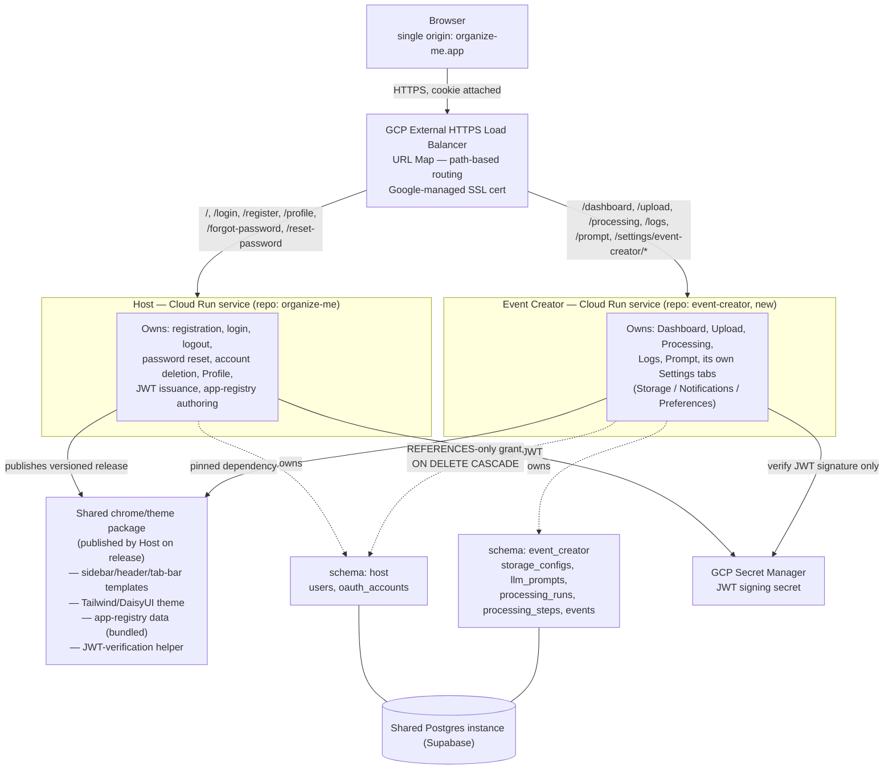

# OrganizeMe Platform Restructure — Technical Design

**Version:** 1.0
**Date:** 2026-07-10
**Status:** Draft
**Implements:** [`docs/platform-restructure-prd.md`](platform-restructure-prd.md)

This document resolves the engineering decisions the PRD deliberately left open (routing mechanism, SSO mechanism, database ownership, styling/chrome sharing) into a concrete architecture, ready for task breakdown.

---

## Architecture at a Glance

- One shared custom domain (`organize-me.app`) fronted by a **GCP External HTTPS Load Balancer** with a **path-based URL map**.
- The URL map routes each request directly to one of two independently deployed **Cloud Run services** — **Host** or **Event Creator** — with **no server-to-server calls between them at request time**.
- Each service renders **full pages independently** (chrome + content), using a **shared, versioned chrome/theme package** published by the Host repo, so there is exactly one visual definition of the sidebar/header/Settings tab-bar.
- **Single sign-on** is stateless: the Host issues a signed JWT cookie on the shared domain; every hosted app verifies that signature independently (no login logic, no network call back to the Host).
- Host and Event Creator share **one Postgres instance** (today's Supabase project) but own **separate schemas** with separate least-privilege DB roles — logical separation enforced at the database layer, not just by convention.
- A single **app-registry file**, authored in the Host repo, is the one source of truth for both the rendered nav/Settings-tab structure *and* the Load Balancer's routing rules.

---

## Component Diagram



## SSO Sequence

```mermaid
sequenceDiagram
    participant U as Browser
    participant LB as Load Balancer
    participant H as Host
    participant EC as Event Creator

    U->>LB: POST /login (credentials)
    LB->>H: routed to Host
    H->>H: verify credentials, sign JWT
    H-->>U: Set-Cookie (JWT; Domain=organize-me.app; Path=/; HttpOnly)

    U->>LB: GET /dashboard (cookie attached automatically)
    LB->>EC: routed to Event Creator (no call to Host)
    EC->>EC: verify JWT signature via Secret Manager, extract user id
    EC-->>U: full page (chrome, rendered via shared package + content)
```

Logout clears the cookie client-side, same as today's single-app behavior — this design doesn't add or remove any server-side session revocation; it inherits the same stateless-JWT property the current app already has.

---

## Components

### Host (repurposed `organize-me` repo)

- **Owns:** registration, login (email/password + Google OAuth), logout, password reset, account deletion, Profile page, JWT signing, authoring the app-registry file, publishing the shared chrome/theme package.
- **Database schema:** `host` — `users`, `oauth_accounts`.
- **Routes:** `/`, `/login`, `/register`, `/forgot-password`, `/reset-password`, `/profile`; `/settings` with no app suffix redirects to the first installed app's first tab.
- **Deploys as:** the existing `organize-me-qa` / `organize-me-prod` Cloud Run services — no rename, since the repo is being repurposed in place, not replaced.

### Event Creator (new repo)

- **Owns:** Dashboard, Upload, Processing Pipeline & Progress, Logs, Prompt, and its own Settings tabs (Storage, Notifications, Preferences) — full functional parity with `docs/prd.md` stories 13–52.
- **Database schema:** `event_creator` — `storage_configs`, `llm_prompts`, `processing_runs`, `processing_steps`, `events`. `user_id` columns keep a real foreign key to `host.users.id` via a narrow `REFERENCES`-only grant (see Data section) with `ON DELETE CASCADE`.
- **Depends on:** the shared chrome/theme package (pinned version) for rendering its full pages, and the bundled JWT-verification helper for identity — never its own login/session logic.
- **Deploys as:** new `event-creator-qa` / `event-creator-prod` Cloud Run services.

### Shared chrome/theme package

Published by the Host repo's CI on tagged release (recommend GitHub Packages, matching the existing GitHub-hosted repos). Contains:

1. Jinja macros/templates for the sidebar, header, and Settings tab-bar.
2. The Tailwind/DaisyUI theme configuration.
3. The **app-registry data**, bundled and versioned alongside the templates — so a given app and the Host always agree on what the full nav/tab set looks like, without any runtime call between them.
4. The JWT-verification helper (signature + expiry check only — no login, no password handling).

Event Creator (and every future hosted app) declares this package as a pinned dependency and bumps the version deliberately to adopt Host chrome changes — a Host-side chrome edit never silently changes what a hosted app renders until that app opts in.

### App-registry file

Authored once, in the Host repo, as the single source of truth. Drives two things from one file:

1. **Rendering** — what each hosted app's sidebar heading/sub-items and Settings tab(s) look like (consumed via the shared package, above).
2. **Routing** — the Load Balancer's URL map path rules (consumed by infrastructure-as-code at provision time; exact IaC tooling is an implementation detail for the build phase, not a design decision).

Sketch of the shape (illustrative, not final):

```yaml
apps:
  - id: event-creator
    name: "Event Creator"
    service_name: event-creator        # Cloud Run service name (per environment)
    nav:
      heading: "Event Creator"
      items:
        - {label: Dashboard,  path: /dashboard}
        - {label: Upload,     path: /upload}
        - {label: Processing, path: /processing}
        - {label: Logs,       path: /logs}
        - {label: Prompt,     path: /prompt}
    settings_tabs:
      - {label: Storage,       path: /settings/event-creator/storage}
      - {label: Notifications, path: /settings/event-creator/notifications}
      - {label: Preferences,   path: /settings/event-creator/preferences}
```

### Load Balancer / routing

- GCP External HTTPS Load Balancer, Google-managed SSL certificate for `organize-me.app`.
- URL map with one Serverless NEG per Cloud Run service, path rules generated from the app-registry file.
- **Prerequisite (unconfirmed):** whether `organize-me.app` is already registered with DNS ready to point at the Load Balancer, or whether that needs to happen as part of this work. Flagged for confirmation before infra provisioning begins.

---

## Data

- One shared Postgres instance (today's Supabase project) — no new database, no data migration.
- **`host` schema:** `users`, `oauth_accounts`. DB role `host_app` has full read/write. `event_creator_app` role has **no access**, except a narrow `REFERENCES`-only grant on `host.users` (enables the FK below without allowing `SELECT`).
- **`event_creator` schema:** `storage_configs`, `llm_prompts`, `processing_runs`, `processing_steps`, `events`. DB role `event_creator_app` has full read/write. `host_app` role has **no access** to this schema at all.
- **Cross-schema FK:** `event_creator.*.user_id` keeps a real foreign key to `host.users.id` with `ON DELETE CASCADE`, so deleting a Host account atomically removes all of that user's Event Creator data at the database level — no synchronous cross-service cleanup call needed for a correctness-critical operation.
- **Migration mechanics:** existing tables move via `ALTER TABLE ... SET SCHEMA` — a metadata-only change, no data rewritten, low risk. This is the concrete mechanism behind the PRD's "no data migration required" claim.
- **Alembic:** each repo keeps its own independent migration history, each with `version_table_schema` pointed at its own schema, so Host's and Event Creator's migrations never collide even though both connect to the same physical database.

---

## Auth / SSO

1. User logs in at the Host (email/password or Google OAuth) — unchanged from today's flow.
2. Host signs a JWT and sets it as an `HttpOnly` cookie: `Domain=organize-me.app`, `Path=/`, `SameSite=Lax` — matching today's cookie approach, just explicitly scoped to the whole shared domain rather than implicitly scoped to a single app.
3. Any subsequent request to any hosted app's path is routed directly there by the Load Balancer; the cookie rides along automatically because it's the same origin.
4. The hosted app's shared JWT-verification helper checks the signature (via a secret in Secret Manager, shared per the platform's "shared infra" tenet) and expiry, and extracts the user id. **No network call to the Host, no session store lookup.**
5. This scales to any number of future hosted apps for free — each just needs the shared chrome package (which bundles the verification helper) and read access to the same signing secret.

---

## Deployment & CI/CD

- **Host repo (`organize-me`):** build → test → publish the shared chrome/theme package (on tagged release) → apply `host`-schema Alembic migrations → deploy `organize-me-qa`/`organize-me-prod` → regenerate the Load Balancer URL map from the app-registry file.
- **Event Creator repo (new):** build → test (including the Host↔Event Creator boundary E2E suite, run against a QA Host) → consume the pinned shared chrome/theme package → apply `event_creator`-schema Alembic migrations → deploy `event-creator-qa`/`event-creator-prod`.
- One shared QA environment, one shared production environment (per the PRD's Design Tenets) — both repos' pipelines target the same Load Balancer/domain, different path prefixes.

---

## Cutover Sequence

1. Confirm `organize-me.app` DNS/registration status; provision the Load Balancer, URL map, and managed SSL cert.
2. Introduce `host` and `event_creator` schemas plus their DB roles in the existing database; move existing tables via `ALTER TABLE ... SET SCHEMA` (no data movement).
3. Strip `organize-me` down to the Host; publish v1 of the shared chrome/theme package.
4. Build the Event Creator repo consuming that package; verify against `docs/prd.md`'s acceptance criteria plus the new boundary E2E suite, in QA.
5. Point the QA Load Balancer's URL map at both services; verify end-to-end in QA.
6. Repeat for production; cut the Load Balancer/DNS live.
7. **Rollback:** since the schema change is additive (`SET SCHEMA`, not destructive) and no data physically moves, rollback doesn't require reversing data — reverting the Load Balancer's URL map or rolling back a Cloud Run revision is sufficient if issues surface.

---

## Open Items Carried Into Implementation

- **`organize-me.app` domain/DNS readiness** — confirm before Load Balancer provisioning (blocking for cutover step 1).
- **IaC tooling** for generating the Load Balancer URL map from the app-registry file (e.g. Terraform vs. a `gcloud` deploy script) — implementation choice, not a design decision.
- **Private package registry** for the shared chrome/theme package — recommend GitHub Packages (matches existing GitHub-hosted repos); confirm during build.
- **JWT signing secret rotation policy** — inherits today's approach unless a reason emerges to change it.
