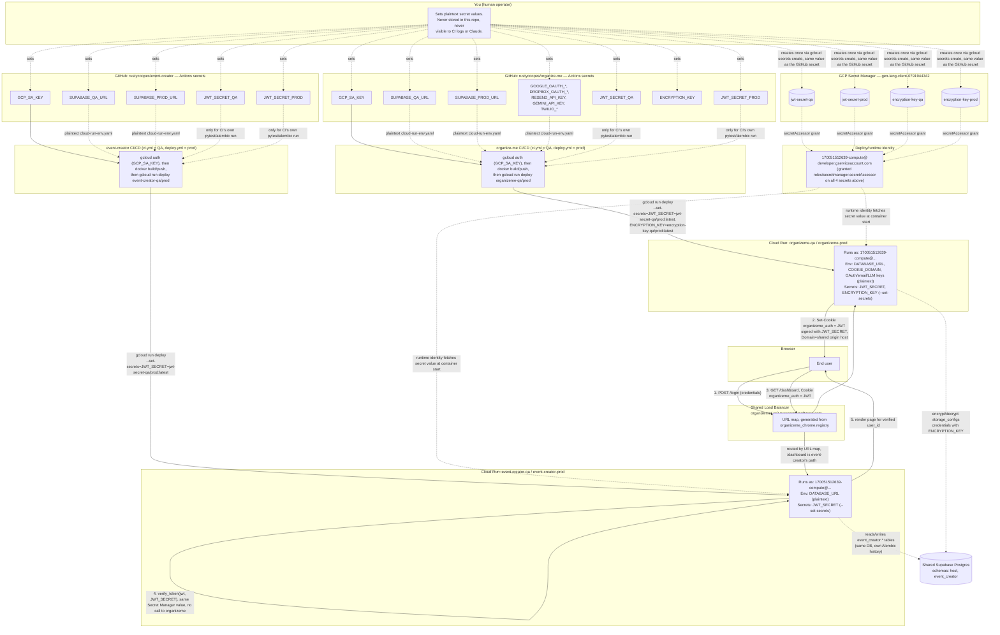

# Secrets, Accounts & Encryption — Reference

How credentials flow across the two repos (`organize-me` = Host, `event-creator`), GitHub Actions,
GCP Secret Manager, and Cloud Run. Written as a durable reference during Slice R6 (Event Creator
scaffold) — update this whenever a secret is added, moved, or a new hosted app joins the platform.

## The two accounts that matter

There are exactly two identities involved in every secret's journey:

- **You** (`rustycoopes` GitHub org owner / `gen-lang-client-0791944342` GCP project owner) — the
  only human who ever sees a secret's plaintext value. You set it once in GitHub Actions secrets
  and/or GCP Secret Manager; no one else (including Claude/CI) can read it back out.
- **The Cloud Run deploy service account**, `170051512639-compute@developer.gserviceaccount.com`
  — the identity every `gcloud run deploy` runs as (via `GCP_SA_KEY`, itself a GitHub secret), and
  the identity every deployed *container* runs as. It's granted `roles/secretmanager.secretAccessor`
  on exactly the Secret Manager secrets listed below — nothing more.

## Where each secret lives, and why

| Secret | Lives in | Why there, not the other place |
|---|---|---|
| `JWT_SECRET` (signing key) | **GCP Secret Manager** (`jwt-secret-qa`, `jwt-secret-prod`) | Read identically by **both** `organizeme-*` and `event-creator-*` Cloud Run services via `--set-secrets` — this is the entire SSO trust mechanism (R4/R6): same key, two independent readers, zero network call between them. |
| `ENCRYPTION_KEY` (Fernet key for stored OAuth/S3 credentials) | **GCP Secret Manager** (`encryption-key-qa`, `encryption-key-prod`) | Encrypts/decrypts `event_creator.storage_configs` rows. Moved off the plaintext env-vars-file in R6 (was previously a plain GitHub secret baked into `organizeme`'s env-vars-file) once a second service's schema depended on it. |
| `DATABASE_URL` (Supabase pooler URL) | **GitHub Actions secret only** (`SUPABASE_QA_URL`/`SUPABASE_PROD_URL`), written into the plaintext `cloud-run-env.yaml` at deploy time | Not itself a credential Cloud Run needs to keep especially secret from its own account — it's consumed the same way DATABASE_URL always has been across both repos. Not yet moved to Secret Manager (candidate for a future hardening pass, see `docs/model-report` deferred issues). |
| `GCP_SA_KEY` | **GitHub Actions secret**, one copy per repo | The credential GitHub Actions itself authenticates to GCP with (`google-github-actions/auth@v2`) — has to exist before any Secret Manager lookup can even happen, so it can't live in Secret Manager itself. |
| `COOKIE_DOMAIN` | Plaintext literal **in the workflow file itself** (not a secret at all) | Not sensitive — it's a public hostname (`organizeme.qa.russcoopersoftware.com` / `organizeme.russcoopersoftware.com`). Written directly into `cloud-run-env.yaml` in `ci.yml`/`deploy.yml`. |
| `GOOGLE_OAUTH_*`, `DROPBOX_OAUTH_*`, `RESEND_API_KEY`, `GEMINI_API_KEY`, `TWILIO_*` | **GitHub Actions secrets**, `organize-me` repo only | Host-only integrations (registration email, LLM extraction, SMS notifications, storage OAuth apps) — `event-creator` doesn't need them yet. Will move to `event-creator`'s own secrets if/when those write-paths move there in R7/R8. |

## Diagram

## Key invariants to preserve

- **`JWT_SECRET` and `ENCRYPTION_KEY` must be byte-identical across every service that reads
  them** (same Secret Manager secret, referenced by name in each repo's `--set-secrets` flag) —
  that's the entire mechanism, not a coincidence. Never let `organize-me` and `event-creator` drift
  onto different values for either.
- **Nothing in a container's own code ever reads a GitHub Actions secret.** GitHub secrets exist
  only to (a) authenticate the CI runner to GCP, and (b) give the CI `test` job's local
  pytest/alembic run something to point at. The actual deployed container gets everything either
  as a plaintext Cloud Run env var (non-sensitive config, or values not yet worth the Secret
  Manager migration) or via `--set-secrets` from GCP Secret Manager (sensitive, cross-service-shared
  values).
- **The deploy service account is the only GCP identity Cloud Run containers run as today** —
  there's no per-service or per-schema account yet. `host_app`/`event_creator_app` Postgres roles
  exist at the DB level (R1 schema separation) but neither app actually connects as them yet; both
  still use the shared admin `DATABASE_URL`. That gap is tracked as a deferred hardening item, not
  fixed as part of R6.
- **Adding a third hosted app** means: a new `<app>-qa`/`<app>-prod` Cloud Run pair, its own
  `GCP_SA_KEY`/`SUPABASE_*_URL` GitHub secrets in its own repo, `--set-secrets=JWT_SECRET=...` in
  its deploy step (same secret name as everyone else), and — only if it needs `ENCRYPTION_KEY`
  too — the same `--set-secrets` addition. No new Secret Manager secret is needed unless that app
  introduces a genuinely new credential type.
- **Cloud Tasks (Slice R11 redesign, event-creator only)**: pipeline dispatch replaced Celery/Redis
  with Cloud Tasks push tasks (see `docs/adr/0001-event-creator-worker-cpu-throttling.md`). No new
  secret — the deploy SA (`170051512639-compute@developer.gserviceaccount.com`, the same shared
  identity as everywhere else in this doc) is granted `roles/cloudtasks.enqueuer` on the
  `event-creator-pipeline-{qa,prod}` queues and `roles/run.invoker` on `event-creator-{qa,prod}`
  itself (provisioned by `event-creator`'s `infra/cloud_tasks/provision.sh`), reused both to
  enqueue tasks and as the OIDC identity Cloud Tasks presents when it pushes back into the
  service. `GCP_PROJECT_ID`/`CLOUD_TASKS_LOCATION`/`CLOUD_TASKS_QUEUE`/
  `PIPELINE_INVOKER_SERVICE_ACCOUNT`/`PIPELINE_ENDPOINT_URL` are plaintext Cloud Run env vars
  (non-sensitive), same treatment as `DATABASE_URL` above.

## Related docs

- `docs/platform-restructure/WBS/slice-R4.md` — domain-scoped cookie + Secret Manager (JWT_SECRET
  first moved here).
- `docs/platform-restructure/WBS/slice-R6.md` — Event Creator scaffold (this doc was written
  alongside it).
- `infra/gcp_lb/README.md` — the Load Balancer/URL-map side of the request flow shown above.
- `app/core/security.py` — `CredentialCipher`, the code that actually uses `ENCRYPTION_KEY`.
